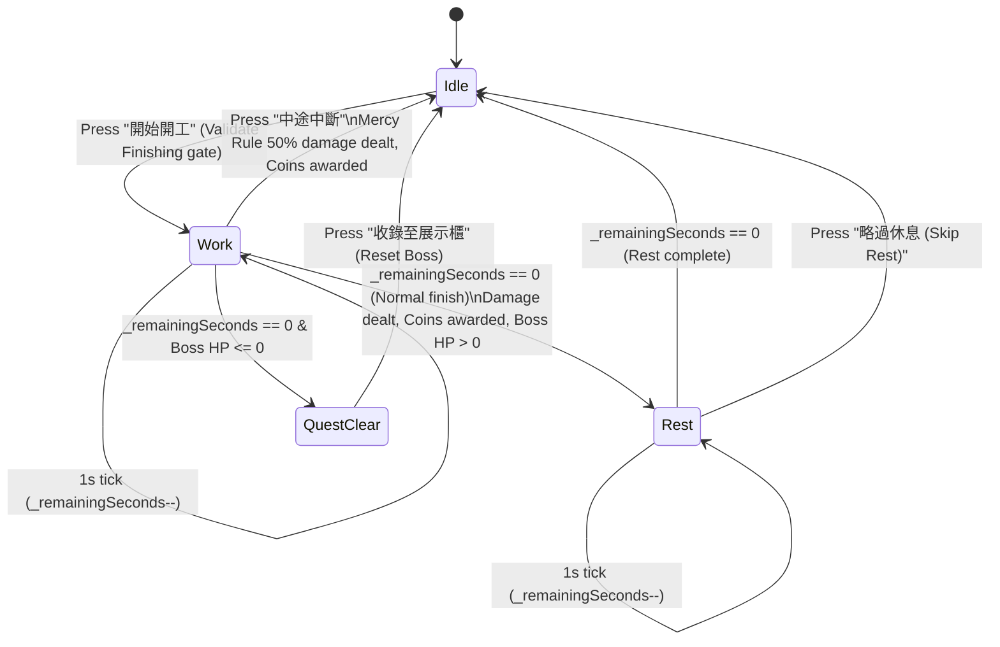

# Milestone 1: UI Integration & State Flow Analysis Report

**Explorer 3**: `teamwork_preview_explorer_m1_3`  
**Date**: 2026-09-11  
**Scope**: Features 1–12 in `PROJECT.md` (UI integration, Pomodoro work/rest transitions, battle flow in `lib/main.dart`, and static analyzer clean verification).

---

## 1. Executive Summary

This investigation explores the presentation and UI state architecture in `lib/main.dart`, focusing on how the UI integrates with the decoupled `BattleEngine`, supports all three Pomodoro timer modes (25m/5m, 50m/10m, 5s debug), orchestrates clean work/rest transitions, handles retro battle feedback, and achieves a 100% clean static analysis (`flutter analyze` 0 errors, 0 warnings, 0 infos).

### Key Discoveries:
1. **Coupled Business Logic**: `lib/main.dart` currently implements inline damage math and hardcodes values (e.g. `100.0 * elapsedRatio`), failing to support the 50m deep focus mode (which requires 220 base points per SPEC §2.1) or proper work/rest cycle transitions.
2. **Missing Rest Cycle**: Currently, `lib/main.dart` only counts down a work session. Upon completion or interruption, the timer halts and state becomes inactive. There is no automated or explicit transition to the rest phase (5m rest for standard, 10m rest for deep focus, 3s rest for debug).
3. **Missing 50m Mode Selector**: The UI only provides buttons for `25m` and `5s測試`. A mode selector (Standard 25m/5m, Deep Focus 50m/10m, Fast Debug 5s/3s) is needed.
4. **Static Analyzer Findings**: `flutter analyze` currently reports exactly **6 issues** across the entire project, all of which are `unnecessary_underscores` in `lib/main.dart` at lines 298:37, 298:41, 676:39, 676:43, 719:39, and 719:43 (`errorBuilder: (_, __, ___)`). Fixing these to `errorBuilder: (_, _, _)` immediately yields 0 errors, 0 warnings, 0 infos.
5. **Existing Widget Test Broken**: `test/widget_test.dart` is an outdated Flutter template counter test that fails (`flutter test` fails with 1 failure). Modernizing it into a smoke test for `TsumiPuraApp` ensures clean test execution.

---

## 2. Current State Analysis of `lib/main.dart`

`lib/main.dart` (1,018 lines) contains the entire MVP app within `BattleAtelierScreen` and `_BattleAtelierScreenState`.

### 2.1 State Variables Breakdown
| Category | Variables in `_BattleAtelierScreenState` | Observation & Status |
| :--- | :--- | :--- |
| **Boss & Player** | `bossName`, `bossGrade`, `maxHp` (500), `currentHp`, `userCoins` | Hardcoded single boss; sufficient for M1. |
| **Pomodoro Timer** | `_timer`, `_remainingSeconds`, `_totalSeconds`, `_isRunning`, `_totalSessionDurationSeconds` | Lacks phase state (`idle`, `work`, `rest`) and mode (`standard`, `deepFocus`, `debug`). |
| **Animation Juice** | `_idleController`, `_shakeController`, `_isHurt`, `_floatingDamageText`, `_floatingDamageColor` | Working correctly: handles idle scale/bounce, screen shake on hit, hurt tint filter, and floating damage indicator. |
| **Craft Process** | `_selectedPhase`, `_phaseMultipliers`, `_phaseSkillNames`, `_phaseActionLogs` | Hardcoded dictionaries within State. Should reference centralized `GameConstants`. |
| **Finishing Gate** | Inline check `(currentHp / maxHp) > 0.2` | Inline calculation in 2 places (`_startTimer` line 118, `_buildSegmentedProcessSelector` line 791). |

### 2.2 Analyzer Verification (`flutter analyze`)
Running `flutter analyze` on the workspace produces:
```
Analyzing nifty-heisenberg...                                   

   info - Unnecessary use of multiple underscores - lib\main.dart:298:37 - unnecessary_underscores
   info - Unnecessary use of multiple underscores - lib\main.dart:298:41 - unnecessary_underscores
   info - Unnecessary use of multiple underscores - lib\main.dart:676:39 - unnecessary_underscores
   info - Unnecessary use of multiple underscores - lib\main.dart:676:43 - unnecessary_underscores
   info - Unnecessary use of multiple underscores - lib\main.dart:719:39 - unnecessary_underscores
   info - Unnecessary use of multiple underscores - lib\main.dart:719:43 - unnecessary_underscores

6 issues found. (ran in 32.0s)
```
- Line 298: Dialog image `errorBuilder: (_, __, ___) => const Icon(Icons.military_tech...)`
- Line 676: Boss sprite `errorBuilder: (_, __, ___) => const Icon(Icons.smart_toy...)`
- Line 719: Hero sprite `errorBuilder: (_, __, ___) => const Icon(Icons.person...)`

In Dart 3.7+ (wildcard variables enabled by default), unused parameters do not need unique names (`__`, `___`), and writing multiple underscores violates the `unnecessary_underscores` lint rule from `package:flutter_lints/flutter.yaml`.
Changing `(_, __, ___)` to `(_, _, _)` completely resolves all 6 issues.

---

## 3. Decoupled UI Integration Architecture

In accordance with Clean Architecture (`PROJECT.md`), UI presentation must delegate math and domain rules to `BattleEngine` and shared constants to `GameConstants`.

```
┌────────────────────────────────────────────────────────┐
│                   Presentation Layer                   │
│             (lib/main.dart / BattleScreen)             │
│  - SegmentedProcessSelector (Phase Skill)              │
│  - PomodoroModeSelector (25m/5m, 50m/10m, 5s)          │
│  - PomodoroTimerHUD (Digital Clock, Phase indicator)   │
│  - BattleControls (Start, Interrupt, Skip Rest, Reset) │
└───────────┬────────────────────────────────┬───────────┘
            │                                │
            ▼ calls                          ▼ reads
┌───────────────────────────────┐ ┌──────────────────────────────┐
│         Domain Layer          │ │          Core Layer          │
│ lib/domain/battle/            │ │ lib/core/constants/          │
│ battle_engine.dart            │ │ game_constants.dart          │
│                               │ │                              │
│ - calculateDamage(...)        │ │ - Craft multipliers          │
│ - canExecuteFinishing(...)    │ │ - Base points (100 / 220)    │
│ - calculateMercyDamage(...)   │ │ - Timer presets (work/rest)  │
└───────────────────────────────┘ └──────────────────────────────┘
```

### 3.1 Interface Binding in `_BattleAtelierScreenState`
```dart
final IBattleEngine _battleEngine = const BattleEngine();
```
1. **Finishing Gate Check**:
   ```dart
   bool get _canExecuteFinishing =>
       _battleEngine.canExecuteFinishing(currentHp: currentHp, maxHp: maxHp);
   ```
2. **Damage Calculation on Work Complete / Interrupt**:
   ```dart
   final int finalDamage = _battleEngine.calculateDamage(
     basePoints: _selectedMode.basePoints,
     phase: _selectedPhase,
     elapsedSeconds: actualElapsedSeconds,
     totalSeconds: _totalSeconds,
     isInterrupted: isInterrupted,
     currentHp: currentHp,
     maxHp: maxHp,
   );
   ```
This cleanly eliminates all inline damage math from `lib/main.dart`.

---

## 4. Pomodoro Mode Selection & Work/Rest State Machine

### 4.1 Mode Definition
We define the three required modes:
```dart
enum PomodoroMode {
  standard(
    label: '標準 25m/5m',
    workSeconds: 25 * 60, // 1500
    restSeconds: 5 * 60,  // 300
    basePoints: 100,
  ),
  deepFocus(
    label: '深度 50m/10m',
    workSeconds: 50 * 60, // 3000
    restSeconds: 10 * 60, // 600
    basePoints: 220,      // Includes 10% focus bonus per SPEC §2.1
  ),
  debug(
    label: '除錯 5s/3s',
    workSeconds: 5,
    restSeconds: 3,
    basePoints: 100,
  );

  final String label;
  final int workSeconds;
  final int restSeconds;
  final int basePoints;

  const PomodoroMode({
    required this.label,
    required this.workSeconds,
    required this.restSeconds,
    required this.basePoints,
  });
}
```

### 4.2 Timer Phase State Machine
```dart
enum PomodoroPhase {
  idle, // Waiting for user to start
  work, // Active work session (damages Boss upon completion/interrupt)
  rest, // Active rest session (no damage; recovery / maintenance period)
}
```



### 4.3 Detailed Transition Rules

1. **Idle -> Work**:
   - Guard condition: `currentHp > 0`.
   - Guard condition: If `_selectedPhase == 'Finishing'`, `_canExecuteFinishing` must be `true` (i.e. `currentHp / maxHp <= 0.20`). If `false`, display SnackBar alert `⚠️ 水貼終結技限定 Boss 殘血 20% 以下發動！` and abort.
   - Sets `_pomodoroPhase = PomodoroPhase.work`.
   - Sets `_totalSeconds = _selectedMode.workSeconds`, `_remainingSeconds = _totalSeconds`.
   - Starts `Timer.periodic(1 second)`.
   - Updates dialogue: `⚔️ 開工中：${skillName}！時間滴答倒數...`

2. **Work Tick (`_remainingSeconds > 0`)**:
   - Decrements `_remainingSeconds`.
   - HUD displays MM:SS in gold (`#FFD54F`).

3. **Work -> Normal Completion (`_remainingSeconds == 0`)**:
   - Cancels work timer.
   - Calls `_battleEngine.calculateDamage(basePoints: _selectedMode.basePoints, phase: _selectedPhase, elapsedSeconds: _totalSeconds, totalSeconds: _totalSeconds, isInterrupted: false, ...)`
   - Calculates plastic coins: `(actualElapsedSeconds / 5).round().clamp(2, 50)`.
   - Triggers retro hit juice (shake, red floating critical damage, hurt flash).
   - Deducts damage from `currentHp` (clamped to 0).
   - If `currentHp <= 0`:
     - Sets `_pomodoroPhase = PomodoroPhase.idle`.
     - Displays `QuestClearDialog`.
   - If `currentHp > 0`:
     - Automatically transitions to `PomodoroPhase.rest`!
     - Sets `_totalSeconds = _selectedMode.restSeconds`, `_remainingSeconds = _totalSeconds`.
     - Starts rest timer.
     - Updates dialogue: `💥 [ActionLog] 造成 [Damage] 點傷害！進入休息時間，請喝水休息整備！`

4. **Work -> Interrupt (`_stopAndSettle`)**:
   - Cancels work timer.
   - `elapsedSeconds = _totalSeconds - _remainingSeconds`.
   - Calls `_battleEngine.calculateDamage(..., isInterrupted: true, elapsedSeconds: elapsedSeconds, totalSeconds: _totalSeconds, ...)`.
   - Triggers retro hit juice with amber Mercy indicator: `'-$damage (MERCY 50%)'`.
   - Deducts damage from `currentHp` (clamped to 0).
   - Sets `_pomodoroPhase = PomodoroPhase.idle`.
   - If `currentHp <= 0`, shows `QuestClearDialog`.
   - Updates dialogue: `⚠️ 中途急停！觸發 Mercy 保底防護，結算 50% 造成 $damage 點傷害。`

5. **Rest -> Idle**:
   - When rest timer hits 0:
     - Cancels timer, sets `_pomodoroPhase = PomodoroPhase.idle`.
     - Updates dialogue: `☕ 休息結束！精神飽滿，請選擇下一工序繼續開工！`
   - When user clicks "略過休息 (Skip Rest)":
     - Cancels timer, sets `_pomodoroPhase = PomodoroPhase.idle`.
     - Updates dialogue: `已略過休息，隨時可再次開工！`

---

## 5. UI Presentation & Layout Design

### 5.1 Pomodoro Mode Selection Widget
Place a Mode Selector directly above the Timer HUD or within the Controls section:
```dart
Widget _buildModeSelector() {
  return Padding(
    padding: const EdgeInsets.only(bottom: 10),
    child: SegmentedButton<PomodoroMode>(
      style: ButtonStyle(
        visualDensity: VisualDensity.compact,
        shape: WidgetStateProperty.all(const RoundedRectangleBorder(borderRadius: BorderRadius.zero)),
        backgroundColor: WidgetStateProperty.resolveWith<Color?>((states) {
          if (states.contains(WidgetState.selected)) return const Color(0xFF6272A4);
          return const Color(0xFF1E1F2E);
        }),
        foregroundColor: WidgetStateProperty.resolveWith<Color?>((states) {
          if (states.contains(WidgetState.selected)) return Colors.white;
          return Colors.white70;
        }),
      ),
      segments: const [
        ButtonSegment(
          value: PomodoroMode.standard,
          label: Text('標準 25m/5m', style: TextStyle(fontSize: 8)),
        ),
        ButtonSegment(
          value: PomodoroMode.deepFocus,
          label: Text('深度 50m/10m', style: TextStyle(fontSize: 8)),
        ),
        ButtonSegment(
          value: PomodoroMode.debug,
          label: Text('除錯 5s/3s', style: TextStyle(fontSize: 8)),
        ),
      ],
      selected: {_selectedMode},
      onSelectionChanged: _pomodoroPhase != PomodoroPhase.idle
          ? null
          : (newSelection) {
              setState(() {
                _selectedMode = newSelection.first;
                _remainingSeconds = _selectedMode.workSeconds;
              });
            },
    ),
  );
}
```

### 5.2 Timer HUD Adaptive Display
```dart
Widget _buildTimerHUD() {
  String statusLabel;
  Color clockColor;
  switch (_pomodoroPhase) {
    case PomodoroPhase.work:
      statusLabel = 'WORK - 專注組裝中 (${_selectedMode.label})';
      clockColor = const Color(0xFFFFD54F); // Amber gold
      break;
    case PomodoroPhase.rest:
      statusLabel = 'REST - 工坊整備休息中 ☕';
      clockColor = const Color(0xFF50FA7B); // Neon mint
      break;
    case PomodoroPhase.idle:
      statusLabel = 'STANDBY - 工匠待命中';
      clockColor = Colors.white70;
      break;
  }

  return Container(
    width: double.infinity,
    padding: const EdgeInsets.symmetric(vertical: 12),
    decoration: BoxDecoration(
      color: const Color(0xFF10111A),
      border: Border.all(
        color: _pomodoroPhase == PomodoroPhase.rest
            ? const Color(0xFF50FA7B)
            : const Color(0xFF282A36),
        width: 2,
      ),
    ),
    child: Column(
      children: [
        Text(
          statusLabel,
          style: TextStyle(
            color: _pomodoroPhase == PomodoroPhase.rest
                ? const Color(0xFF50FA7B)
                : Colors.white38,
            fontSize: 8,
            letterSpacing: 1.2,
            fontWeight: FontWeight.bold,
          ),
        ),
        const SizedBox(height: 6),
        Text(
          _formatTime(_remainingSeconds),
          style: TextStyle(
            fontSize: 34,
            fontWeight: FontWeight.bold,
            color: clockColor,
            letterSpacing: 2,
          ),
        ),
      ],
    ),
  );
}
```

### 5.3 Adaptive Control Buttons
- **When `currentHp <= 0`**:
  - Big Green Button: `重置 Boss 血量 (RESTART)`
- **When `PomodoroPhase.idle`**:
  - Mode toggle row (`標準 25m/5m` | `深度 50m/10m` | `除錯 5s/3s`)
  - Big Start Button: `開始開工 (${_selectedMode.label.split(' ')[0]})`
- **When `PomodoroPhase.work`**:
  - Big Red Button: `中途中斷 (結算 50% 保底傷害)`
- **When `PomodoroPhase.rest`**:
  - Big Blue/Teal Button: `略過休息 (提前開工)`

---

## 6. Static Analysis & Verification Plan

### 6.1 Lint Issue Resolution
The 6 lints in `lib/main.dart` are:
1. `lib/main.dart:298:37` & `298:41`: `errorBuilder: (_, __, ___) => const Icon(...)`
2. `lib/main.dart:676:39` & `676:43`: `errorBuilder: (_, __, ___) => const Icon(...)`
3. `lib/main.dart:719:39` & `719:43`: `errorBuilder: (_, __, ___) => const Icon(...)`

**Fix**:
Change all occurrences of `errorBuilder: (_, __, ___)` to:
```dart
errorBuilder: (_, _, _) => const Icon(...)
```

### 6.2 Test Suite Modernization
- **Update `test/widget_test.dart`**:
  Replace the obsolete default counter test with a valid smoke test that pumps `TsumiPuraApp` and confirms:
  - Header displays `'TSUMI-PURA RPG'`
  - Boss Card displays `'HG 1/144'` and `'HP'`
  - Process selector displays `'素組\n1.0x'` and `'水貼\n🔒20%'`
  - Start button `'開始開工'` is present.
- **Add `test/unit/battle_engine_test.dart`**:
  Verify math, 5 craft multipliers, 50m base points (220), 5s debug (100), finishing lock/unlock at 20% HP, mercy rule 50%, and edge cases.

---

## 7. Implementation Recommendations for Worker

1. **Step 1: Create Core Constants & Battle Engine**:
   - Write `lib/core/constants/game_constants.dart`
   - Write `lib/domain/battle/battle_engine.dart`
2. **Step 2: Fix 6 Lints in `lib/main.dart`**:
   - Update `errorBuilder` signatures to `(_, _, _)`.
3. **Step 3: Integrate `lib/main.dart` with `BattleEngine` & `PomodoroMode`**:
   - Replace inline multiplier maps and base points with `GameConstants` / `PomodoroMode`.
   - Introduce `PomodoroPhase` state machine.
   - Connect `calculateDamage` and `canExecuteFinishing` calls.
   - Add Mode selection widget and work/rest transitions.
4. **Step 4: Update Tests & Verify**:
   - Write `test/unit/battle_engine_test.dart`.
   - Update `test/widget_test.dart`.
   - Run `flutter analyze` and confirm 0 issues.
   - Run `flutter test` and confirm 100% passing tests.
