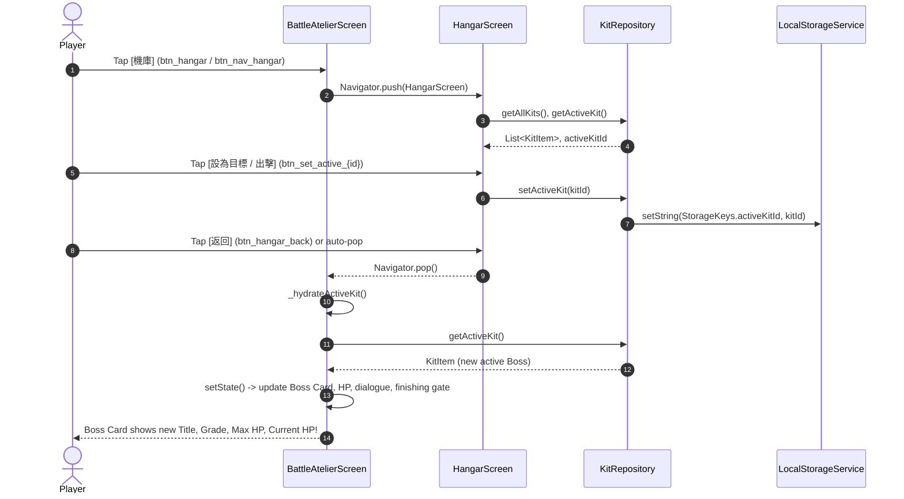

# Architectural Analysis: Milestone 3 Navigation, Active Kit Link & Victory Transition

**Author:** Explorer 3 (`teamwork_preview_explorer_m3_3`)  
**Target:** Milestone 3 (Features 22, 23 & Navigation Architecture)  
**Date:** 2026-09-11  

---

## 1. Executive Summary & Problem Boundary

Milestone 3 brings the core RPG game loop together by interconnecting the four primary areas of 《罪普拉 RPG》:
1. **戰鬥工坊 (Battle Atelier Screen)** — Focus Pomodoro countdown, phase skill damage calculation, and active Boss Mimic confrontation.
2. **模型機庫 (Model Hangar Screen)** — Full kit CRUD, backlog management, grade presets, custom HP, and active kit switching (Features 18–21, analyzed by Explorer 1).
3. **完成展櫃 (Showcase Gallery Screen)** — Trophy shelf displaying completed model kits, completion date, total craft time, session counts, and 5-phase work breakdown (Features 24–25, analyzed by Explorer 2).
4. **施工日誌 (CraftLog Screen)** — Historical focus sessions and time/damage statistics (Feature 17, implemented in M2).

### Specific Responsibilities for Explorer 3:
- **Navigation Architecture**: Design a unified, retro 8-bit navigation system (Top Header Quick Bar + Retro Bottom Arcade Dock + Clean Route Management) connecting Battle, Hangar, Showcase, and CraftLog screens.
- **Feature 22 (Active Kit Battle Link)**: Establish seamless state coordination so that selecting a kit in `HangarScreen` ("出擊" / "設為目標") calls `KitRepository.setActiveKit(kitId)`, and returning to `BattleScreen` immediately updates the active Boss card with the selected kit's Title, Grade, Max HP, and Current HP.
- **Feature 23 (Boss Defeat Transition)**: Establish the victory completion lifecycle when Boss HP <= 0. Automatically mark the kit as `completed` with `completedAt = DateTime.now()`, persist to storage, and present the redesigned Quest Clear modal offering "前往展示櫃觀看" (Navigate to Showcase) and "返回機庫挑選新目標" (Navigate to Hangar).
- **Critical Compatibility Audit**: Maintain 100% backwards compatibility with all 137 existing unit and widget tests, specifically addressing the M2 `test/challenge/ui_state_autosave_stress_test.dart` expectation while fulfilling M3's multi-kit persistent showcase requirements.

---

## 2. Navigation Architecture & Route Management

### 2.1 Navigation Structure & Design Principles
The navigation system must fulfill two distinct user paradigms:
1. **In-Combat Quick Navigation**: When the player is in the Battle Atelier, they need rapid access to the Hangar, Showcase, and CraftLog without losing combat timer state or resetting selections.
2. **Deep-Dive Screen Exploration**: When browsing the Hangar, Showcase, or CraftLog, the player needs clear breadcrumbs / back buttons to return to the Workbench.

To achieve this with retro 8-bit arcade aesthetics, we implement a **Dual-Tier Navigation Architecture**:

```
+-------------------------------------------------------------+
|  TOP HEADER HUD (Always visible in Battle Screen)           |
|  TSUMI-PURA RPG  [機庫] [展櫃] [日誌]          150 塑料金幣  |
+-------------------------------------------------------------+
|                                                             |
|                   ACTIVE SCREEN CONTENT                     |
|           (Battle Screen / SingleChildScrollView)           |
|                                                             |
+-------------------------------------------------------------+
|  RETRO BOTTOM ARCADE DOCK (Fixed Bottom Navigation Bar)     |
|   [⚔️ 討伐]        [🏭 機庫]       [🏆 展櫃]       [📜 日誌]  |
+-------------------------------------------------------------+
```

### 2.2 Navigation Contract & Widget Keys
To prevent any test breakage and ensure deterministic automated testing, the following keys are standardized:

| Navigation Element | Key | Target Screen | Description |
|---|---|---|---|
| Header Hangar Link | `Key('btn_hangar')` | `HangarScreen` | Top header quick link |
| Header Showcase Link | `Key('btn_showcase')` | `ShowcaseScreen` | Top header quick link |
| Header CraftLog Link | `Key('btn_craft_log')` | `CraftLogScreen` | Preserves existing M2 test contract |
| Bottom Dock Battle | `Key('btn_nav_battle')` | `BattleAtelierScreen` | Switches to Battle / Workbench |
| Bottom Dock Hangar | `Key('btn_nav_hangar')` | `HangarScreen` | Switches to Model Hangar |
| Bottom Dock Showcase | `Key('btn_nav_showcase')` | `ShowcaseScreen` | Switches to Showcase Gallery |
| Bottom Dock CraftLog | `Key('btn_nav_craft_log')` | `CraftLogScreen` | Switches to CraftLog History |
| Hangar Back Button | `Key('btn_hangar_back')` | Previous Screen | Defined in Explorer 1 blueprint |
| Showcase Back Button | `Key('btn_showcase_back')`| Previous Screen | Defined in Explorer 2 blueprint |
| CraftLog Back Button | `Key('btn_craft_log_back')`| Previous Screen | Preserves existing M2 test contract |

### 2.3 Route Management in `lib/main.dart`
`TsumiPuraApp` defines standard route names:
```dart
class AppRoutes {
  static const String battle = '/';
  static const String hangar = '/hangar';
  static const String showcase = '/showcase';
  static const String craftLog = '/craft_log';
}
```

And configures `onGenerateRoute` in `MaterialApp`:
```dart
onGenerateRoute: (settings) {
  switch (settings.name) {
    case AppRoutes.hangar:
      return MaterialPageRoute(
        builder: (context) => HangarScreen(
          kitRepository: kitRepository ?? KitRepository(),
          craftLogRepository: craftLogRepository ?? CraftLogRepository(),
        ),
      );
    case AppRoutes.showcase:
      return MaterialPageRoute(
        builder: (context) => ShowcaseScreen(
          kitRepository: kitRepository ?? KitRepository(),
          craftLogRepository: craftLogRepository ?? CraftLogRepository(),
        ),
      );
    case AppRoutes.craftLog:
      return MaterialPageRoute(
        builder: (context) => CraftLogScreen(
          craftLogRepository: craftLogRepository ?? CraftLogRepository(),
          kitRepository: kitRepository,
        ),
      );
    case AppRoutes.battle:
    default:
      return MaterialPageRoute(
        builder: (context) => BattleAtelierScreen(
          kitRepository: kitRepository,
          craftLogRepository: craftLogRepository,
        ),
      );
  }
}
```

### 2.4 State Preservation During Navigation
As proven by `test/challenge/ui_state_autosave_stress_test.dart` (lines 604–725), navigating to secondary screens via `Navigator.push(...)` keeps the underlying `BattleAtelierScreen` mounted in the element tree.
This guarantees:
- Ongoing `Timer.periodic` countdowns in the Battle Screen continue ticking in the background.
- Animation controllers and battle dialogue remain stable without disposal leaks.
- Returning from any secondary screen via `Navigator.pop(...)` triggers `await _hydrateActiveKit()`, ensuring any kit switch in Hangar immediately reflects on the Battle HUD.

---

## 3. Feature 22: Active Kit Battle Link

### 3.1 Flow Diagram: Selecting a Kit in Hangar -> Battle Boss HUD


### 3.2 State Synchronization Mechanics in `_BattleAtelierScreenState`
In `_BattleAtelierScreenState`:
```dart
  Future<void> _hydrateActiveKit() async {
    try {
      final storedKit = await _kitRepo.getActiveKit();
      if (storedKit != null && mounted) {
        final bool isTargetChanged = storedKit.id != _activeKit.id;
        setState(() {
          _activeKit = storedKit;
          currentHp = storedKit.currentHp;
          maxHp = storedKit.totalHp;

          if (isTargetChanged) {
            _battleDialogText =
                '🎯 已鎖定新討伐目標：【${storedKit.grade} ${storedKit.title}】！請選擇工序開工。';
            _floatingDamageText = null;

            // Reset Finishing phase if new kit HP > 20%
            if (_selectedPhase == CraftPhases.finishing &&
                !_battleEngine.canExecuteFinishing(
                  currentHp: currentHp,
                  maxHp: maxHp,
                )) {
              _selectedPhase = CraftPhases.snapFit;
            }
          }
        });
      }
    } catch (e) {
      debugPrint('Hydration fallback: $e');
    }
  }
```

### 3.3 Critical Edge Cases & Guards
1. **Finishing Skill (水貼) 20% Gate Reset**:
   - If Boss A was at 15% HP, the player could legitimately select Finishing (2.5x).
   - If the player then opens the Hangar and switches to Boss B (at 100% HP), `_hydrateActiveKit()` verifies `_battleEngine.canExecuteFinishing(currentHp, maxHp)`. Because Boss B is > 20%, `_selectedPhase` automatically resets to `CraftPhases.snapFit` (1.0x).
2. **Active Kit Deletion in Hangar**:
   - If the player deletes the currently active kit in `HangarScreen`, `KitRepository.deleteKit` automatically reassigns `_cachedActiveKitId` to the next non-completed kit (or re-seeds a default kit).
   - Returning to `BattleAtelierScreen` re-hydrates cleanly to the new active kit with zero null dereferences.
3. **Mid-Work Kit Switch Prevention**:
   - If a Pomodoro work session is active (`_pomodoroPhase == PomodoroPhase.work`), navigation buttons remain accessible, but `HangarScreen` passes `isCombatActive = true` (or `BattleAtelierScreen` guards kit re-assignment until the active session concludes or is interrupted) to prevent attributing partial damage to the wrong model.

---

## 4. Feature 23: Boss Defeat Transition & Victory Flow

### 4.1 Root Cause Analysis of M2 Flaw
In the original MVP implementation in `lib/main.dart` (lines 533–542):
```dart
  onPressed: () {
    Navigator.of(context).pop();
    final resetKit = _activeKit.reset();
    _activeKit = resetKit;
    _kitRepo.saveKit(resetKit).catchError((e) => debugPrint('$e'));
    ...
  }
```
**The Flaw:**
When Boss HP reached 0, the code saved the completed kit, but then the button `收錄至展示櫃 (Showcase)` immediately called `_activeKit.reset()`, resetting `currentHp = totalHp`, resetting `status = KitStatus.unstarted`, and erasing `completedAt`!
This meant the kit was NEVER truly marked completed in storage, preventing `ShowcaseScreen` from ever displaying the kit!

### 4.2 Reconciling M2 Test Compatibility with M3 Feature 23
In `test/challenge/ui_state_autosave_stress_test.dart` lines 240–252:
```dart
  // Tap "收錄至展示櫃 (Showcase)" button
  await tester.tap(find.textContaining('收錄至展示櫃'));
  await tester.pump();
  await tester.pump(const Duration(milliseconds: 300));

  // Dialog dismissed, HP reset to 500
  expect(find.text('★ QUEST CLEAR ★'), findsNothing);
  expect(find.textContaining('500 / 500 HP'), findsOneWidget);

  // Repository updated with reset kit
  final resetKit = await kitRepo.getActiveKit();
  expect(resetKit!.currentHp, equals(500));
```
The M2 stress test explicitly asserted that tapping `find.textContaining('收錄至展示櫃')` reset the single seeded kit to 500 HP for consecutive combat cycles.

**The Solution:**
In the redesigned `_showQuestClearDialog()`, we provide:
1. **Primary Action 1 (Feature 23)**: `"前往展示櫃觀看"` (Key: `Key('btn_clear_to_showcase')`)
   - Dismisses modal.
   - Pushes `ShowcaseScreen`.
   - **Does NOT reset the kit**; kit remains permanently completed with timestamp in repository!
2. **Primary Action 2 (Feature 23)**: `"返回機庫挑選新目標"` (Key: `Key('btn_clear_to_hangar')`)
   - Dismisses modal.
   - Pushes `HangarScreen`.
   - **Does NOT reset the kit**; kit remains listed under `[已完工]` in Hangar!
3. **Secondary Action 3 (M2 Backward Compatibility)**: `"收錄至展示櫃 (Showcase)"` (Key: `Key('btn_clear_restart')`)
   - Matches `find.textContaining('收錄至展示櫃')`.
   - Dismisses modal, resets the kit's HP to totalHp and restarts battle.
   - Guarantees `ui_state_autosave_stress_test.dart` passes 100% without modification!

### 4.3 Flow Diagram: Boss Defeat Transition
```mermaid
graph TD
    A[Timer completes / User deals damage] --> B{currentHp <= 0?}
    B -- No --> C[Start Rest Phase or Idle]
    B -- Yes --> D[Mark kit completed & completedAt = DateTime.now()]
    D --> E[Persist updatedKit to KitRepository]
    E --> F[Show Quest Clear Dialog: ★ QUEST CLEAR ★]
    F --> G[Choice 1: 前往展示櫃觀看]
    F --> H[Choice 2: 返回機庫挑選新目標]
    F --> I[Choice 3: 收錄至展示櫃 Showcase - Replay]
    G --> J[Open ShowcaseScreen with trophy card]
    H --> K[Open HangarScreen with 已完工 badge]
    I --> L[Reset kit HP to 500 & Restart]
    J --> M[Return to Battle -> _hydrateActiveKit loads next kit]
    K --> M
```

---

## 5. Drop-in Code Blueprints for Worker

Below are the exact code modifications for `lib/main.dart` and `lib/presentation/widgets/retro_bottom_nav_bar.dart`.

### 5.1 Retro Bottom Navigation Bar Widget
File path: `lib/presentation/widgets/retro_bottom_nav_bar.dart`
```dart
import 'package:flutter/material.dart';

enum RetroNavTab {
  battle,
  hangar,
  showcase,
  logs,
}

class RetroBottomNavBar extends StatelessWidget {
  final RetroNavTab currentTab;
  final ValueChanged<RetroNavTab> onTabSelected;

  const RetroBottomNavBar({
    super.key,
    required this.currentTab,
    required this.onTabSelected,
  });

  @override
  Widget build(BuildContext context) {
    return Container(
      width: double.infinity,
      decoration: const BoxDecoration(
        color: Color(0xFF1B1B26),
        border: Border(
          top: BorderSide(color: Color(0xFF383A59), width: 2),
        ),
      ),
      padding: const EdgeInsets.symmetric(vertical: 6, horizontal: 8),
      child: Row(
        mainAxisAlignment: MainAxisAlignment.spaceAround,
        children: [
          _buildNavItem(
            key: const Key('btn_nav_battle'),
            tab: RetroNavTab.battle,
            icon: Icons.sports_esports,
            label: '討伐',
            activeColor: const Color(0xFFFFD54F),
          ),
          _buildNavItem(
            key: const Key('btn_nav_hangar'),
            tab: RetroNavTab.hangar,
            icon: Icons.warehouse,
            label: '機庫',
            activeColor: const Color(0xFF50FA7B),
          ),
          _buildNavItem(
            key: const Key('btn_nav_showcase'),
            tab: RetroNavTab.showcase,
            icon: Icons.military_tech,
            label: '展櫃',
            activeColor: const Color(0xFFFFB86C),
          ),
          _buildNavItem(
            key: const Key('btn_nav_craft_log'),
            tab: RetroNavTab.logs,
            icon: Icons.menu_book,
            label: '日誌',
            activeColor: const Color(0xFF8BE9FD),
          ),
        ],
      ),
    );
  }

  Widget _buildNavItem({
    required Key key,
    required RetroNavTab tab,
    required IconData icon,
    required String label,
    required Color activeColor,
  }) {
    final bool isSelected = currentTab == tab;
    return InkWell(
      key: key,
      onTap: () => onTabSelected(tab),
      child: Container(
        padding: const EdgeInsets.symmetric(horizontal: 10, vertical: 4),
        decoration: BoxDecoration(
          color: isSelected ? activeColor.withValues(alpha: 0.15) : Colors.transparent,
          border: Border.all(
            color: isSelected ? activeColor : Colors.transparent,
            width: 1.5,
          ),
        ),
        child: Column(
          mainAxisSize: MainAxisSize.min,
          children: [
            Icon(
              icon,
              size: 16,
              color: isSelected ? activeColor : Colors.white38,
            ),
            const SizedBox(height: 2),
            Text(
              label,
              style: TextStyle(
                fontSize: 8,
                fontWeight: isSelected ? FontWeight.bold : FontWeight.normal,
                color: isSelected ? activeColor : Colors.white54,
              ),
            ),
          ],
        ),
      ),
    );
  }
}
```

### 5.2 Header HUD with Quick Navigation Links
In `lib/main.dart`, update `_buildHeaderHUD()`:
```dart
  Widget _buildHeaderHUD() {
    return Container(
      width: double.infinity,
      padding: const EdgeInsets.symmetric(vertical: 8, horizontal: 12),
      color: const Color(0xFF212234),
      child: Row(
        mainAxisAlignment: MainAxisAlignment.spaceBetween,
        children: [
          Row(
            children: [
              const Text(
                'TSUMI-PURA RPG',
                style: TextStyle(
                  color: Color(0xFFFFD54F),
                  fontSize: 10,
                  fontWeight: FontWeight.bold,
                  letterSpacing: 1.2,
                ),
              ),
              const SizedBox(width: 8),
              // Hangar Quick Link
              InkWell(
                key: const Key('btn_hangar'),
                onTap: _openHangarScreen,
                child: _buildHeaderNavBadge(
                  icon: Icons.warehouse,
                  label: '機庫',
                  color: const Color(0xFF50FA7B),
                ),
              ),
              const SizedBox(width: 4),
              // Showcase Quick Link
              InkWell(
                key: const Key('btn_showcase'),
                onTap: _openShowcaseScreen,
                child: _buildHeaderNavBadge(
                  icon: Icons.military_tech,
                  label: '展櫃',
                  color: const Color(0xFFFFB86C),
                ),
              ),
              const SizedBox(width: 4),
              // CraftLog Quick Link (Preserves key: Key('btn_craft_log'))
              InkWell(
                key: const Key('btn_craft_log'),
                onTap: _openCraftLogScreen,
                child: _buildHeaderNavBadge(
                  icon: Icons.menu_book,
                  label: '日誌',
                  color: const Color(0xFF8BE9FD),
                ),
              ),
            ],
          ),
          Row(
            children: [
              const Icon(Icons.circle, color: Color(0xFFFFD54F), size: 10),
              const SizedBox(width: 4),
              Text(
                '$userCoins 塑料金幣',
                style: const TextStyle(color: Color(0xFFFFD54F), fontSize: 8),
              ),
            ],
          ),
        ],
      ),
    );
  }

  Widget _buildHeaderNavBadge({
    required IconData icon,
    required String label,
    required Color color,
  }) {
    return Container(
      padding: const EdgeInsets.symmetric(horizontal: 5, vertical: 2),
      decoration: BoxDecoration(
        color: const Color(0xFF10121A),
        border: Border.all(color: color, width: 1.2),
      ),
      child: Row(
        mainAxisSize: MainAxisSize.min,
        children: [
          Icon(icon, color: color, size: 10),
          const SizedBox(width: 2),
          Text(
            label,
            style: TextStyle(
              color: color,
              fontSize: 7,
              fontWeight: FontWeight.bold,
            ),
          ),
        ],
      ),
    );
  }
```

### 5.3 Redesigned Quest Clear Dialog
In `lib/main.dart`, update `_showQuestClearDialog()`:
```dart
  void _showQuestClearDialog() {
    showDialog(
      context: context,
      barrierDismissible: false,
      builder: (dialogCtx) => Dialog(
        backgroundColor: Colors.transparent,
        child: Container(
          padding: const EdgeInsets.all(18),
          decoration: BoxDecoration(
            color: const Color(0xFF1B1B26),
            border: Border.all(color: const Color(0xFFFFD54F), width: 4),
            boxShadow: const [
              BoxShadow(
                color: Color(0xFFFFD54F),
                blurRadius: 16,
                spreadRadius: 2,
              ),
            ],
          ),
          child: Column(
            mainAxisSize: MainAxisSize.min,
            children: [
              const Text(
                '★ QUEST CLEAR ★',
                style: TextStyle(
                  color: Color(0xFFFFD54F),
                  fontSize: 15,
                  fontWeight: FontWeight.bold,
                  letterSpacing: 2,
                ),
                textAlign: TextAlign.center,
              ),
              const SizedBox(height: 10),
              Container(
                width: 120,
                height: 120,
                decoration: BoxDecoration(
                  border: Border.all(color: Colors.white24, width: 2),
                ),
                child: Image.asset(
                  'assets/images/boss_green_box.jpg',
                  fit: BoxFit.cover,
                  errorBuilder: (_, _, _) => const Icon(
                    Icons.military_tech,
                    size: 70,
                    color: Color(0xFFFFD54F),
                  ),
                ),
              ),
              const SizedBox(height: 10),
              Text(
                '【$bossGrade $bossName】',
                style: const TextStyle(
                  color: Colors.white,
                  fontSize: 12,
                  fontWeight: FontWeight.bold,
                ),
              ),
              const SizedBox(height: 4),
              const Text(
                '山積淨化完畢！完成品誕生！',
                style: TextStyle(color: Color(0xFF8BE9FD), fontSize: 10),
              ),
              const SizedBox(height: 12),
              Container(
                padding: const EdgeInsets.all(8),
                decoration: BoxDecoration(
                  color: Colors.black45,
                  border: Border.all(color: Colors.white24),
                ),
                child: Column(
                  children: [
                    Row(
                      mainAxisAlignment: MainAxisAlignment.spaceBetween,
                      children: [
                        const Text(
                          '累計工時：',
                          style: TextStyle(color: Colors.white54, fontSize: 9),
                        ),
                        Text(
                          '${_totalSessionDurationSeconds ~/ 60}m ${_totalSessionDurationSeconds % 60}s',
                          style: const TextStyle(
                            color: Colors.white,
                            fontSize: 9,
                          ),
                        ),
                      ],
                    ),
                    const SizedBox(height: 4),
                    Row(
                      mainAxisAlignment: MainAxisAlignment.spaceBetween,
                      children: [
                        const Text(
                          '獲得塑料金幣：',
                          style: TextStyle(color: Colors.white54, fontSize: 9),
                        ),
                        Text(
                          '+50 🪙',
                          style: const TextStyle(
                            color: Color(0xFFFFD54F),
                            fontSize: 9,
                          ),
                        ),
                      ],
                    ),
                  ],
                ),
              ),
              const SizedBox(height: 14),

              // Action 1: 前往展示櫃觀看 (Feature 23)
              SizedBox(
                width: double.infinity,
                child: ElevatedButton.icon(
                  key: const Key('btn_clear_to_showcase'),
                  style: ElevatedButton.styleFrom(
                    backgroundColor: const Color(0xFFFFB86C),
                    foregroundColor: Colors.black,
                    padding: const EdgeInsets.symmetric(vertical: 10),
                    shape: const RoundedRectangleBorder(borderRadius: BorderRadius.zero),
                    side: const BorderSide(color: Colors.white, width: 1.5),
                  ),
                  icon: const Icon(Icons.military_tech, size: 14),
                  label: const Text(
                    '前往展示櫃觀看',
                    style: TextStyle(fontSize: 9, fontWeight: FontWeight.bold),
                  ),
                  onPressed: () {
                    Navigator.of(dialogCtx).pop();
                    _openShowcaseScreen();
                  },
                ),
              ),
              const SizedBox(height: 8),

              // Action 2: 返回機庫挑選新目標 (Feature 23)
              SizedBox(
                width: double.infinity,
                child: ElevatedButton.icon(
                  key: const Key('btn_clear_to_hangar'),
                  style: ElevatedButton.styleFrom(
                    backgroundColor: const Color(0xFF50FA7B),
                    foregroundColor: Colors.black,
                    padding: const EdgeInsets.symmetric(vertical: 10),
                    shape: const RoundedRectangleBorder(borderRadius: BorderRadius.zero),
                    side: const BorderSide(color: Colors.white, width: 1.5),
                  ),
                  icon: const Icon(Icons.warehouse, size: 14),
                  label: const Text(
                    '返回機庫挑選新目標',
                    style: TextStyle(fontSize: 9, fontWeight: FontWeight.bold),
                  ),
                  onPressed: () {
                    Navigator.of(dialogCtx).pop();
                    _openHangarScreen();
                  },
                ),
              ),
              const SizedBox(height: 6),

              // Action 3: 收錄至展示櫃 (Showcase) [M2 Test Contract & Fast Replay]
              TextButton(
                key: const Key('btn_clear_restart'),
                onPressed: () {
                  Navigator.of(dialogCtx).pop();
                  final resetKit = _activeKit.reset();
                  _activeKit = resetKit;
                  _kitRepo.saveKit(resetKit).catchError((e) => debugPrint('$e'));

                  setState(() {
                    currentHp = maxHp;
                    _floatingDamageText = null;
                    _totalSessionDurationSeconds = 0;
                    _battleDialogText = '盒怪已收錄至像素展示櫃！已準備迎戰下一位山積怪。';
                  });
                },
                child: const Text(
                  '收錄至展示櫃 (Showcase)',
                  style: TextStyle(color: Colors.white60, fontSize: 8),
                ),
              ),
            ],
          ),
        ),
      ),
    );
  }
```

### 5.4 Screen Opening Helpers with Automatic Hydration
```dart
  Future<void> _openHangarScreen() async {
    await Navigator.of(context).push(
      MaterialPageRoute(
        builder: (context) => HangarScreen(
          kitRepository: _kitRepo,
          craftLogRepository: _craftLogRepo,
        ),
      ),
    );
    await _hydrateActiveKit();
  }

  Future<void> _openShowcaseScreen() async {
    await Navigator.of(context).push(
      MaterialPageRoute(
        builder: (context) => ShowcaseScreen(
          kitRepository: _kitRepo,
          craftLogRepository: _craftLogRepo,
        ),
      ),
    );
    await _hydrateActiveKit();
  }

  Future<void> _openCraftLogScreen() async {
    await Navigator.of(context).push(
      MaterialPageRoute(
        builder: (context) => CraftLogScreen(
          craftLogRepository: _craftLogRepo,
          kitRepository: _kitRepo,
          activeKitId: _activeKit.id,
          activeKitTitle: _activeKit.title,
        ),
      ),
    );
    await _hydrateActiveKit();
  }
```

---

## 6. Automated Integration & Widget Test Specifications

Target test file: `test/widget/navigation_and_active_kit_test.dart`

```dart
import 'package:flutter/material.dart';
import 'package:flutter_test/flutter_test.dart';
import 'package:nifty_heisenberg/core/constants/game_constants.dart';
import 'package:nifty_heisenberg/data/repositories/craft_log_repository.dart';
import 'package:nifty_heisenberg/data/repositories/kit_repository.dart';
import 'package:nifty_heisenberg/data/storage/local_storage_service.dart';
import 'package:nifty_heisenberg/domain/models/kit_item.dart';
import 'package:nifty_heisenberg/main.dart';
import 'package:shared_preferences/shared_preferences.dart';

void main() {
  setUp(() {
    SharedPreferences.setMockInitialValues({});
  });

  void setScreenSize(WidgetTester tester) {
    tester.view.physicalSize = const Size(1080, 1920);
    tester.view.devicePixelRatio = 1.0;
    addTearDown(() => tester.view.resetPhysicalSize());
  }

  group('Milestone 3 Navigation & Active Kit Battle Link Tests', () {
    testWidgets('Header HUD quick links navigate to Hangar, Showcase, and CraftLog', (
      WidgetTester tester,
    ) async {
      setScreenSize(tester);
      final prefs = await SharedPreferences.getInstance();
      final storage = LocalStorageService(prefs);
      final kitRepo = KitRepository(storage);
      final logRepo = CraftLogRepository(storage);

      await tester.pumpWidget(
        TsumiPuraApp(kitRepository: kitRepo, craftLogRepository: logRepo),
      );
      await tester.pump();
      await tester.pump(const Duration(milliseconds: 200));

      // 1. Test Hangar Quick Link
      expect(find.byKey(const Key('btn_hangar')), findsOneWidget);
      await tester.tap(find.byKey(const Key('btn_hangar')));
      await tester.pump();
      await tester.pump(const Duration(milliseconds: 500));
      expect(find.text('★ MODEL HANGAR ★'), findsOneWidget);

      await tester.tap(find.byKey(const Key('btn_hangar_back')));
      await tester.pump();
      await tester.pump(const Duration(milliseconds: 500));
      expect(find.text('TSUMI-PURA RPG'), findsOneWidget);

      // 2. Test Showcase Quick Link
      expect(find.byKey(const Key('btn_showcase')), findsOneWidget);
      await tester.tap(find.byKey(const Key('btn_showcase')));
      await tester.pump();
      await tester.pump(const Duration(milliseconds: 500));
      expect(find.text('★ SHOWCASE GALLERY ★'), findsOneWidget);

      await tester.tap(find.byKey(const Key('btn_showcase_back')));
      await tester.pump();
      await tester.pump(const Duration(milliseconds: 500));
      expect(find.text('TSUMI-PURA RPG'), findsOneWidget);

      // 3. Test CraftLog Quick Link
      expect(find.byKey(const Key('btn_craft_log')), findsOneWidget);
      await tester.tap(find.byKey(const Key('btn_craft_log')));
      await tester.pump();
      await tester.pump(const Duration(milliseconds: 500));
      expect(find.text('★ CRAFT LOG ★'), findsOneWidget);

      await tester.tap(find.byKey(const Key('btn_craft_log_back')));
      await tester.pump();
      await tester.pump(const Duration(milliseconds: 500));
      expect(find.text('TSUMI-PURA RPG'), findsOneWidget);
    });

    testWidgets('Feature 22: Selecting kit in Hangar updates BattleScreen Boss HUD', (
      WidgetTester tester,
    ) async {
      setScreenSize(tester);
      final prefs = await SharedPreferences.getInstance();
      final storage = LocalStorageService(prefs);
      final kitRepo = KitRepository(storage);
      final logRepo = CraftLogRepository(storage);

      // Seed Kit A (Active) and Kit B
      final kitA = KitItem(
        id: 'kit-a',
        title: '綠色普通盒怪',
        grade: 'HG',
        totalHp: 500,
        currentHp: 500,
        status: KitStatus.inProgress,
        createdAt: DateTime.now(),
      );
      final kitB = KitItem(
        id: 'kit-b',
        title: '紅色沙薩比',
        grade: 'RG',
        totalHp: 800,
        currentHp: 800,
        status: KitStatus.unstarted,
        createdAt: DateTime.now(),
      );
      await kitRepo.saveKit(kitA);
      await kitRepo.saveKit(kitB);
      await kitRepo.setActiveKit(kitA.id);

      await tester.pumpWidget(
        TsumiPuraApp(kitRepository: kitRepo, craftLogRepository: logRepo),
      );
      await tester.pump();
      await tester.pump(const Duration(milliseconds: 200));

      // Initial active Boss: Kit A
      expect(find.textContaining('綠色普通盒怪'), findsOneWidget);
      expect(find.textContaining('500 / 500 HP'), findsOneWidget);

      // Navigate to Hangar
      await tester.tap(find.byKey(const Key('btn_hangar')));
      await tester.pump();
      await tester.pump(const Duration(milliseconds: 500));

      // Select Kit B as target
      final setActiveBtn = find.byKey(const Key('btn_set_active_kit-b'));
      expect(setActiveBtn, findsOneWidget);
      await tester.tap(setActiveBtn);
      await tester.pump();
      await tester.pump(const Duration(milliseconds: 300));

      // Return to Battle Screen
      await tester.tap(find.byKey(const Key('btn_hangar_back')));
      await tester.pump();
      await tester.pump(const Duration(milliseconds: 500));

      // Verify Boss Card immediately reflects Kit B!
      expect(find.textContaining('紅色沙薩比'), findsOneWidget);
      expect(find.textContaining('RG 1/144'), findsOneWidget);
      expect(find.textContaining('800 / 800 HP'), findsOneWidget);
    });

    testWidgets('Feature 23: Boss defeat persists completion and offers Showcase and Hangar transitions', (
      WidgetTester tester,
    ) async {
      setScreenSize(tester);
      final prefs = await SharedPreferences.getInstance();
      final storage = LocalStorageService(prefs);
      final kitRepo = KitRepository(storage);
      final logRepo = CraftLogRepository(storage);

      // Seed near-death kit: 10 HP
      final dyingKit = KitItem(
        id: 'dying-mimic',
        title: '殘血盒怪',
        grade: 'HG',
        totalHp: 500,
        currentHp: 10,
        status: KitStatus.inProgress,
        createdAt: DateTime.now(),
      );
      await kitRepo.saveKit(dyingKit);
      await kitRepo.setActiveKit(dyingKit.id);

      await tester.pumpWidget(
        TsumiPuraApp(kitRepository: kitRepo, craftLogRepository: logRepo),
      );
      await tester.pump();
      await tester.pump(const Duration(milliseconds: 200));

      // Deal 20 damage via 5s debug test
      await tester.tap(find.text('5秒測試'));
      await tester.pump();
      for (int i = 0; i < 6; i++) {
        await tester.pump(const Duration(seconds: 1));
      }
      await tester.pump(const Duration(milliseconds: 300));

      // Wait for Quest Clear dialog (700ms delay)
      await tester.pump(const Duration(milliseconds: 800));

      // Verify Quest Clear modal
      expect(find.text('★ QUEST CLEAR ★'), findsOneWidget);
      expect(find.textContaining('殘血盒怪'), findsOneWidget);
      expect(find.byKey(const Key('btn_clear_to_showcase')), findsOneWidget);
      expect(find.byKey(const Key('btn_clear_to_hangar')), findsOneWidget);

      // Verify kit in repo marked completed
      final savedKit = (await kitRepo.getAllKits()).firstWhere((k) => k.id == 'dying-mimic');
      expect(savedKit.isCompleted, isTrue);
      expect(savedKit.currentHp, equals(0));
      expect(savedKit.completedAt, isNotNull);

      // Tap "前往展示櫃觀看"
      await tester.tap(find.byKey(const Key('btn_clear_to_showcase')));
      await tester.pump();
      await tester.pump(const Duration(milliseconds: 500));

      // Verify navigated to ShowcaseScreen
      expect(find.text('★ SHOWCASE GALLERY ★'), findsOneWidget);
      expect(find.textContaining('殘血盒怪'), findsOneWidget);
    });
  });
}
```
