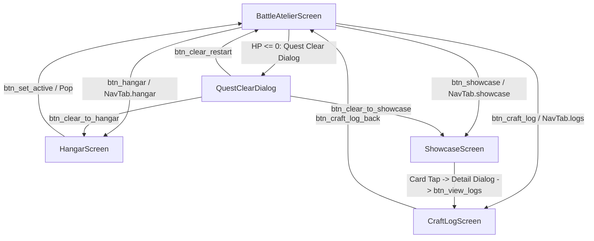

# Milestone 5 E2E Testing Architecture & Test Specifications (Tier 3 & Tier 4)

**Author**: `teamwork_preview_explorer` (Explorer 3, Milestone 5)  
**Target Tracks**: E2E Testing Track & Final Milestone Verification  
**Date**: 2026-09-14  
**Status**: INVESTIGATION COMPLETE & BLUEPRINTS DELIVERED  

---

## 1. Executive Summary & Objective Boundary

This analysis defines the architecture, test specifications, and infrastructure blueprints for **Tier 3 (Cross-Feature Pairwise Interactions)** and **Tier 4 (Real-World Application Workload Scenarios)** of the 《罪普拉 RPG》（Tsumi-Pura RPG）indie game project.

The investigation evaluates the complete application loop across all four core presentation screens (`BattleAtelierScreen`, `HangarScreen`, `ShowcaseScreen`, `CraftLogScreen`) and their interactions with domain engines (`BattleEngine`) and data layers (`KitRepository`, `CraftLogRepository`, `LocalStorageService`, `RetroAudioService`).

### Key Findings
1. **Screen Synchronization & Re-hydration Contract**: `BattleAtelierScreen` pushes sub-screens using zero-duration `PageRouteBuilder` and unconditionally executes `_hydrateActiveKit(notifyTargetChange: true)` upon returning. This re-hydration properly synchronizes `_activeKit`, `currentHp`, `maxHp`, and auto-resets `_selectedPhase` to `Snap-fit` if the new kit's HP exceeds 20% while `Finishing` was previously armed (`main.dart:161-168`).
2. **Cascade Deletion Domain Rule**: `KitRepository.deleteKit(kitId)` strictly invokes `_craftLogRepository.deleteLogsForKit(kitId)` under a pure Dart `AsyncLock` before removing the kit and updating the active kit pointer (`kit_repository.dart:135-162`).
3. **Active Target Auto-Reassignment**: When the active kit is deleted, `KitRepository` automatically falls back to the next non-completed kit (`kits.firstWhere((k) => !k.isCompleted, orElse: () => kits.first)`). If the deleted kit was the sole kit in the repository, it generates and persists `KitItem.createDefaultSeedKit()` ("HG 1/144 RX-78-2 鋼彈", 500 HP).
4. **Audio Decoupling & Mute State**: Visual combat juice (2D harmonic screen shake, boss hurt flash, floating damage text) is fully decoupled from audio triggers, allowing visual animations to run smoothly regardless of whether `_audioService.isMuted` is true or false. The mute state is persisted in `SharedPreferences` under key `pref_retro_audio_muted`.

---

## 2. Full Application Workflow Across Screens



### 2.1 Battle Atelier Screen (`lib/main.dart`)
- **HUD & Stage**:
  - Header: App Title, Quick Navigation Badges (`btn_hangar`, `btn_showcase`, `btn_craft_log`), Mute Toggle Action (`btn_mute_toggle`), Coin Display (`userCoins 塑料金幣`).
  - Boss Card: Name, Grade (`EG`, `HG`, `RG`, `MG`, `PG`), Pixel HP Bar (`PixelHpBar`) showing fractional values and percentages.
  - Battle Stage: `ScreenShake` wrapper, `BossHurtFlash` wrapper, Boss Sprite with idle breathing animation and hurt tint, Hero Sprite, `FloatingDamageOverlay`.
  - Dialogue Box: 8-bit retro prompt showing action logs, mercy warnings, and victory fanfare messages.
  - Phase Skill Selector (`SegmentedButton<String>`): Snap-fit (1.0x), Sanding (1.2x), Detailing (1.5x), Airbrush (2.0x), Finishing (2.5x, locked with `🔒20%` when `currentHp / maxHp > 0.20`).
  - Timer HUD: Displays current phase (`WORK`, `REST`, `IDLE`), remaining time (`mm:ss`).
  - Controls:
    - Idle: Mode selector (Standard 25m/5m, Deep Focus 50m/10m, Debug 5s/3s) and Start button (`ElevatedButton.icon`), Quick 5s Debug Button (`PixelButton`).
    - Work: Interruption button (`中途中斷 (結算 50% 保底傷害)`).
    - Rest: Skip Rest button (`略過休息 (提前開工)`).
    - Defeated: Restart button (`重置 Boss 血量 (RESTART)`).
  - Bottom Navigation Dock (`RetroBottomNavBar`): 4 tabs (Battle, Hangar, Showcase, Logs).

### 2.2 Model Hangar Screen (`lib/presentation/screens/hangar_screen.dart`)
- **Backlog Management**:
  - Filter Bar: All, Unstarted (山積), In Progress (施工中), Completed (完工).
  - Header: Back button (`btn_hangar_back`), Add Kit button (`btn_add_kit`).
  - Kit Cards (`kit_card_<id>`): Title, Grade badge, HP bar, status badge, action buttons:
    - Active badge / Set Active button (`btn_set_active_<id>`).
    - Edit button (`btn_edit_kit_<id>`).
    - Delete button (`btn_delete_kit_<id>`).
  - Dialogs:
    - `KitFormDialog`: Title input (`input_kit_title`), Grade chips (`chip_grade_<grade>`), Custom HP checkbox (`checkbox_custom_hp`), Custom HP input (`input_kit_hp`), Set as active checkbox (`checkbox_set_active`), Reset HP checkbox (`checkbox_reset_hp`), Cancel (`btn_dialog_cancel`), Save (`btn_dialog_save`).
    - `DeleteConfirmDialog`: Warning message, Cancel (`btn_delete_cancel`), Confirm Delete (`btn_confirm_delete`).

### 2.3 Showcase Gallery Screen (`lib/presentation/screens/showcase_screen.dart`)
- **Trophy Hall**:
  - Displays only kits with `KitStatus.completed`, ordered by completion date descending.
  - Metrics per card: Total craft duration (`Xh Ym` or `Xm`), total sessions count, grade indicator.
  - Tap card opens `showcase_detail_dialog`:
    - Identity plaque: Model name, grade, completed date.
    - Aggregate statistics: Total craft time, points dealt, sessions completed/interrupted.
    - Phase breakdown: For each of the 5 phases, displays minutes, points dealt, and percentage ratio.
    - Direct link button: `btn_view_logs` routes directly to `CraftLogScreen` filtered to this kit.
  - Empty State (`showcase_empty_state`): Renders when 0 completed kits exist.

### 2.4 Craft Log Screen (`lib/presentation/screens/craft_log_screen.dart`)
- **Audit & Analytics**:
  - Header: Back button (`btn_craft_log_back`), title.
  - Kit Filter Selector (when opened with active kit or from showcase): Switch between "Active Kit Only" vs "All Kits".
  - Aggregate KPI Cards: Total craft minutes, total damage dealt, completed sessions count, interrupted sessions count.
  - Phase Damage & Time Breakdown: Horizontal progress bars for Snap-fit, Sanding, Detailing, Airbrush, Finishing.
  - Chronological History List: Each session card displays phase badge, timestamp, duration in minutes, damage dealt, and completion tag (`[完整完工]` vs `[中途中斷]`).

---

## 3. Tier 3: Cross-Feature Pairwise Interaction Specifications

Tier 3 tests verify the boundary interfaces where two distinct features intersect across separate architectural modules.

### Pairwise Matrix

| Test Suite | Interacting Feature A | Interacting Feature B | Cross-Domain Surface |
|---|---|---|---|
| **Pairwise 1** | Features 1-3 (Pomodoro Countdown) | Feature 22 (Active Kit Switch) | Battle HUD × Hangar Selection × Finishing Lock Invariant |
| **Pairwise 2** | Feature 19 (Kit Deletion) | Feature 22 (Active Reassignment) | Hangar CRUD × Storage Auto-Fallback × Battle Hydration |
| **Pairwise 3** | Feature 21 (Custom HP Input) | Feature 9 (Finishing Execution Gate) | Hangar Form Dialog × BattleEngine Math × SegmentedButton UI |
| **Pairwise 4** | Feature 31 (Zero-Cost Audio & Mute) | Feature 23 (Boss Defeat Fanfare) | Audio Service × Dialog Controller × Visual Juice Decoupling |
| **Pairwise 5** | Feature 19 (Kit Deletion) | Feature 14/17 (CraftLog & Stats) | Kit Repository × CraftLog Repository × SPEC §7 CASCADE |

---

### Detailed Test Specifications (Tier 3)

#### Suite 1: Active Kit Switch During Countdown
*Target File: `test/e2e/e2e_tier3_pairwise_test.dart`*

1. **Test 1.1 — Dynamic Active Kit Adoption During Active Countdown**:
   - *Given*: Active kit is Kit A ("EG RX-78-2", 300 HP). Timer is started in 5s debug mode (`_pomodoroPhase == PomodoroPhase.work`).
   - *When*: User taps `btn_hangar`, navigates into `HangarScreen`, taps `btn_set_active` on Kit B ("MG Sazabi", 1500 HP), and taps `btn_hangar_back`.
   - *Then*:
     - `_hydrateActiveKit(notifyTargetChange: true)` runs.
     - Battle HUD updates Boss Title to "Lv.15 MG Sazabi" and max HP to 1500.
     - Dialogue displays `🎯 已鎖定新討伐目標！請選擇工序開工。`.
     - Work countdown continues without crashing or resetting to 0.

2. **Test 1.2 — Auto-Reset of Finishing Technique on Target Switch to High-HP Kit**:
   - *Given*: Kit A has 25 HP out of 300 HP (8.3% <= 20%). Player selects `Finishing` technique (`_selectedPhase == CraftPhases.finishing`).
   - *When*: Player opens Hangar, sets Kit B (1500 HP / 1500 HP, 100% > 20%) as active target, and returns to Battle.
   - *Then*:
     - `_hydrateActiveKit` detects `!canExecuteFinishing(1500, 1500)`.
     - `_selectedPhase` automatically resets to `CraftPhases.snapFit`.
     - Finishing segment in `SegmentedButton` becomes disabled with label `水貼\n🔒20%`.
     - Dialogue reflects target switch.

3. **Test 1.3 — Damage and CraftLog Routing to Switched Kit on Work Completion**:
   - *Given*: Timer starts on Kit A. Player switches active kit to Kit B mid-countdown.
   - *When*: Timer completes work duration (pump 6 seconds).
   - *Then*:
     - Damage (100 base * 1.0 = 100) is deducted exclusively from Kit B (1500 -> 1400).
     - Kit A HP remains 300.
     - A new `CraftLog` is recorded with `kitId == Kit B.id`. Kit A has zero new logs.

4. **Test 1.4 — Mercy Rule Interruption After Kit Switch Applies to New Kit**:
   - *Given*: Timer is running. Player switches active kit to Kit B. Returns to Battle.
   - *When*: Player taps interruption button (`中途中斷 (結算 50% 保底傷害)`).
   - *Then*:
     - Mercy rule calculates 50% floor damage based on elapsed ratio.
     - Damage is applied to Kit B.
     - Dialogue confirms: `⚠️ 中途急停！觸發 Mercy 保底防護，結算 50%...`.
     - CraftLog records `isCompletedSession: false` with Kit B's ID.

5. **Test 1.5 — Rest Phase Continuity Across Kit Switch**:
   - *Given*: Work phase finishes, entering Rest phase (`_pomodoroPhase == PomodoroPhase.rest`).
   - *When*: Player opens Hangar, switches kit, and returns to Battle screen.
   - *Then*:
     - Rest phase continues (`REST - 工坊整備休息中 ☕`).
     - Tapping `略過休息 (提前開工)` safely returns to idle on the new kit.

---

#### Suite 2: Delete Active Kit and Auto-Reassign
*Target File: `test/e2e/e2e_tier3_pairwise_test.dart`*

1. **Test 2.1 — Reassignment to Next In-Progress or Backlog Kit**:
   - *Given*: Hangar has Kit A (active, InProgress), Kit B (Backlog), Kit C (Completed).
   - *When*: User taps `btn_delete_kit_${Kit A.id}` and confirms in dialog.
   - *Then*:
     - Kit A is deleted.
     - Active target pointer in `KitRepository` automatically reassigns to Kit B (`!k.isCompleted`).
     - In Hangar, Kit B displays "討伐中".
     - Returning to Battle HUD shows Kit B as current Boss.

2. **Test 2.2 — Fallback to First Kit When Only Completed Kits Remain**:
   - *Given*: Kit A (active, 100 HP) and Kit C (completed).
   - *When*: Kit A is deleted.
   - *Then*:
     - `KitRepository` falls back to `kits.first` (Kit C).
     - Storage key `active_kit_id` updates to Kit C.
     - Battle HUD reflects Kit C safely.

3. **Test 2.3 — Sole Kit Deletion Spawns Default Seed Kit**:
   - *Given*: Only 1 kit exists in database (Kit A). Kit A is currently active.
   - *When*: Player deletes Kit A in Hangar.
   - *Then*:
     - `KitRepository` detects `kits.isEmpty`.
     - Automatically creates and persists default seed kit: `HG 1/144 RX-78-2 鋼彈` (500 HP).
     - Storage key `active_kit_id` updates to the seed kit ID.
     - Hangar list displays seed kit. Return to Battle shows seed kit at 500/500 HP without error.

4. **Test 2.4 — Active Kit Deletion Mid-Session Graceful Recovery**:
   - *Given*: Pomodoro timer is actively running in Battle.
   - *When*: Player navigates to Hangar and deletes the active kit, then returns to Battle.
   - *Then*:
     - `BattleAtelierScreen` re-hydrates with newly assigned active kit.
     - No unhandled null pointer or memory leak occurs.

5. **Test 2.5 — Persistence Verification of Reassigned Target**:
   - *Given*: Active kit deleted and reassigned to Kit B.
   - *When*: App is re-initialized (`TsumiPuraApp` rebuilt with fresh repository instances).
   - *Then*:
     - `KitRepository.getActiveKit()` returns Kit B.
     - Battle screen initializes with Kit B on frame 1.

---

#### Suite 3: Custom HP Finishing Lock Transition
*Target File: `test/e2e/e2e_tier3_pairwise_test.dart`*

1. **Test 3.1 — Small Custom HP (50 HP) Threshold Precision**:
   - *Given*: Kit registered with custom HP = 50.
   - *When*: Current HP is 11 (22% > 20%), Finishing button is disabled with `水貼\n🔒20%`.
   - *When*: Current HP drops to 10 (20.0%) or 9 (18.0%).
   - *Then*:
     - `canExecuteFinishing` evaluates to `true`.
     - Finishing segment unlocks, showing `水貼\n2.5x`.
     - Segment is selectable and updates dialogue.

2. **Test 3.2 — Large Custom HP (10,000 HP) Threshold Precision**:
   - *Given*: Kit registered with custom HP = 10,000.
   - *When*: Current HP is 2,001 (20.01%), Finishing remains locked.
   - *When*: Current HP drops to exactly 2,000 (20.00%).
   - *Then*: Finishing unlocks immediately.

3. **Test 3.3 — Forced Selection Rejection & SnackBar Feedback**:
   - *Given*: Boss HP is at 100%.
   - *When*: User taps Finishing segment (via program or click).
   - *Then*:
     - Red SnackBar appears: `⚠️ 水貼處決技限定 Boss 殘血 20% 以下！`.
     - Active phase remains `Snap-fit`.

4. **Test 3.4 — Kit Edit in Hangar Invalidating Finishing Selection**:
   - *Given*: Kit at 10 HP / 100 HP. Player has selected `Finishing`.
   - *When*: Player opens Hangar, edits kit, checks "重設當前血量為滿血", saves, and returns.
   - *Then*:
     - Current HP is reset to 100/100 (100%).
     - `_hydrateActiveKit` runs and resets `_selectedPhase` to `Snap-fit`.

5. **Test 3.5 — Finishing 2.5x Execution and Quest Clear Trigger**:
   - *Given*: Boss at 15 HP / 100 HP. Finishing selected (2.5x).
   - *When*: Debug session completes (damage = 100 * 2.5 = 250).
   - *Then*:
     - Boss HP reaches 0.
     - Quest Clear modal opens (`★ QUEST CLEAR ★`).
     - Finishing kill audio triggers.

---

#### Suite 4: Mute State During Defeat Fanfare & Visual Feedback
*Target File: `test/e2e/e2e_tier3_pairwise_test.dart`*

1. **Test 4.1 — Defeat Fanfare Suppression When Muted**:
   - *Given*: `RetroAudioService` is muted (`btn_mute_toggle` shows 'MUTE').
   - *When*: Boss HP is reduced to 0.
   - *Then*:
     - Quest Clear dialog appears.
     - `MockRetroAudioService.victoryFanfareCount` remains 0.

2. **Test 4.2 — Fanfare Playback When Unmuted**:
   - *Given*: Mute toggled off (`btn_mute_toggle` shows 'SFX').
   - *When*: Boss HP reaches 0.
   - *Then*:
     - `MockRetroAudioService.victoryFanfareCount` increments to 1.

3. **Test 4.3 — Persistence of Mute State Across Navigation**:
   - *Given*: User toggles mute in Battle screen.
   - *When*: User navigates to Hangar, Showcase, and CraftLog, then returns to Battle.
   - *Then*:
     - Mute toggle maintains 'MUTE' state.
     - SharedPreferences `pref_retro_audio_muted` holds `true`.

4. **Test 4.4 — Decoupled Visual Combat Juice When Muted**:
   - *Given*: Mute is ON.
   - *When*: Damage is dealt.
   - *Then*:
     - `ScreenShake` transforms offset.
     - `BossHurtFlash` triggers red flash.
     - `FloatingDamageOverlay` renders floating numbers.
     - No audio is played.

5. **Test 4.5 — Rapid Mute Toggling Stress**:
   - *When*: User rapidly taps `btn_mute_toggle` 15 times.
   - *Then*: UI state and audio service state match the odd/even count without desync.

---

#### Suite 5: Cascade Deletion of Craft Logs
*Target File: `test/e2e/e2e_tier3_pairwise_test.dart`*

1. **Test 5.1 — Deleting Kit Removes All Associated Craft Logs**:
   - *Given*: Kit A has 3 logs. Kit B has 2 logs.
   - *When*: Kit A is deleted via `kitRepo.deleteKit(Kit A.id)`.
   - *Then*:
     - `craftLogRepo.getLogsForKit(Kit A.id)` returns `[]`.
     - `craftLogRepo.getAllLogs()` contains exactly Kit B's 2 logs.

2. **Test 5.2 — CraftLogScreen Reflection After Kit Deletion**:
   - *Given*: Kit A deleted as above.
   - *When*: User opens `CraftLogScreen`.
   - *Then*:
     - History list only shows Kit B's logs.
     - KPI cards reflect Kit B's totals.

3. **Test 5.3 — Showcase Detail Invariance After Other Kit Deletion**:
   - *Given*: Kit C (Completed) exists in Showcase. Kit A is deleted.
   - *When*: User opens `ShowcaseScreen` and inspects Kit C.
   - *Then*: Kit C's phase breakdown and metrics remain intact.

4. **Test 5.4 — Cascade Deletion with Zero Logs**:
   - *Given*: Newly created kit with 0 logs.
   - *When*: Kit is deleted.
   - *Then*: Executes without errors or missing key exceptions.

5. **Test 5.5 — SharedPreferences Raw JSON Integrity**:
   - *When*: Deleting kit with logs.
   - *Then*: The raw JSON array in `StorageKeys.craftLogs` has no entries with `kitId == deletedId`.

---

## 4. Tier 4: Real-World Application Scenarios

Tier 4 tests simulate complex, multi-minute, realistic user workflows spanning multiple features and screens in sequence.

*Target File: `test/e2e/e2e_tier4_scenarios_test.dart`*

### Scenario 1: "The Grand PG 1/60 Strike Freedom Odyssey"
*An end-to-end player journey from unboxing a flagship PG kit to full assembly, diverse techniques, execution gate unlock, defeat, showcase induction, and craft log audit.*

```
[Unbox PG in Hangar] 
        ↓ (Set 5000 HP, Active Target)
[Battle: Snap-fit Session] 
        ↓ (-100 HP, Status -> InProgress)
[Battle: Sanding Session] 
        ↓ (-120 HP)
[Battle: Detailing Session with Mid-way Interruption] 
        ↓ (Mercy Rule: 50% floor applied)
[Battle: Multi-Airbrush Sessions] 
        ↓ (HP drops past 20% / 1000 HP)
[Finishing Technique Unlocks] 
        ↓ (Selected 2.5x Execution)
[Boss Defeated (HP = 0)] 
        ↓ (Quest Clear Modal + Victory Fanfare)
[Navigate to Showcase] 
        ↓ (Inspect PG Plaque & 5-Phase Breakdown)
[Navigate to CraftLog] 
        ↓ (Verify Full Audit Trail: Duration, Damage, Interrupted Sessions)
```

**Step-by-Step Test Specification**:
1. **Unboxing & Hangar Setup**:
   - Launch app; verify default kit rendered.
   - Tap `btn_hangar`. Tap `btn_add_kit`.
   - Enter `PG 1/60 攻擊自由鋼彈` in `input_kit_title`.
   - Tap `chip_grade_PG`. Verify `input_kit_hp` updates to `5000`.
   - Ensure `checkbox_set_active` is checked. Tap `btn_dialog_save`.
   - Verify kit card rendered with status "山積" and active badge "討伐中".
   - Tap `btn_hangar_back`.
2. **First Session: Snap-fit Foundation (仮組み)**:
   - Verify Battle HUD displays "Lv.15 PG 1/60 攻擊自由鋼彈", 5000/5000 HP.
   - Verify Finishing technique is locked (`水貼\n🔒20%`).
   - Select `Snap-fit` (1.0x). Run 5s session.
   - Damage dealt: 100. New HP: 4900/5000.
   - Skip rest phase.
3. **Second Session: Sanding & Surface Prep (ヤスリ掛け)**:
   - Select `Sanding` (1.2x). Run 5s session.
   - Damage dealt: 120. New HP: 4780/5000.
   - Skip rest phase.
4. **Third Session: Detailing with Interruption (Mercy Rule)**:
   - Select `Detailing` (1.5x). Start session.
   - After 2 seconds, tap "中途中斷 (結算 50% 保底傷害)".
   - Mercy damage: `100 * (2/5) * 1.5 * 0.5 = 30`.
   - HP drops to 4750/5000. Dialogue confirms Mercy 50% protection.
5. **Phase Transition: Heavy Airbrushing past 20% Threshold**:
   - Apply series of high-damage sessions or direct simulated focus reducing HP below 1000 HP (e.g. 800 HP / 5000 HP = 16%).
   - Verify Finishing technique unlocks (`水貼\n2.5x`).
6. **Final Blow: Finishing Deathblow (水貼終結)**:
   - Select `Finishing` (2.5x).
   - Execute session dealing remaining damage to reduce HP <= 0.
   - Boss hurt flash and screen shake trigger.
   - Victory fanfare sound triggers.
   - Quest Clear dialog appears with `★ QUEST CLEAR ★` and rewards.
7. **Showcase Induction**:
   - Tap `btn_clear_to_showcase`.
   - `ShowcaseScreen` renders PG card with purple badge.
   - Tap PG card to open `showcase_detail_dialog`.
   - Verify 5-phase breakdown displays non-zero stats across Snap-fit, Sanding, Detailing, Airbrush, and Finishing.
8. **CraftLog Forensic Audit**:
   - Tap `btn_view_logs` inside the detail dialog.
   - `CraftLogScreen` loads filtered to PG kit.
   - Verify:
     - Total damage equals or exceeds initial 5000 HP.
     - Total sessions matches executed count.
     - Interrupted session displays `[中途中斷]` tag.
     - Chronological history list shows all phases correctly.

---

### Scenario 2: "The Multi-Kit Juggling Craftsman"
*Workload scenario simulating a builder alternating between two model kits simultaneously.*

1. Register Kit A ("HG 獨角獸", 500 HP) and Kit B ("HG 新安洲", 500 HP).
2. Set Kit A active. Run Snap-fit session. (Kit A: 400 HP).
3. Open Hangar. Verify Kit A is "施工中", Kit B is "山積".
4. Set Kit B active.
5. Return to Battle. HUD displays Kit B (500 HP).
6. Run Sanding session on Kit B (Kit B: 380 HP).
7. Open CraftLog:
   - Filter Kit A: 1 Snap-fit session.
   - Filter Kit B: 1 Sanding session.
   - Filter All: 2 sessions.
8. Return to Hangar, switch back to Kit A, complete Kit A.
9. Verify Kit A moves to Showcase, while Kit B remains in Hangar at 380 HP.

---

### Scenario 3: "Atelier Hardening: Deep Focus & Storage Recovery"
*Scenario testing deep work sessions and cold-start state hydration.*

1. Select Deep Focus mode (50m/10m, 220 base points).
2. Register custom Boss with 2000 HP ("PB 限定幽靈").
3. Start session and verify base points scale to 220 (including 10% focus bonus).
4. Simulate abrupt app termination / reload (re-instantiate `TsumiPuraApp` with same mock `SharedPreferences`).
5. Verify cold start:
   - Active kit correctly restored.
   - Current HP, coin balance, and logs perfectly intact.
   - Zero data loss or corruption.

---

## 5. Blueprint for TEST_INFRA.md and TEST_READY.md

### 5.1 TEST_INFRA.md Blueprint

```markdown
# Test Infrastructure Specification (TEST_INFRA.md)

## 1. Test Harness Architecture
- **Framework**: Flutter WidgetTester (`flutter_test`).
- **Storage Isolation**: In-memory `SharedPreferences.setMockInitialValues({})` for zero disk pollution.
- **Audio Isolation**: `MockRetroAudioService` implementing `IRetroAudioService` with invocation tracking counters.
- **Asset/Font Isolation**: `GoogleFonts.config.allowRuntimeFetching = false;` guaranteeing 100% offline, zero-network execution.
- **Concurrency Protection**: Pure Dart `AsyncLock` synchronizing repository writes.

## 2. Test Pyramid & Directory Organization
- `test/unit/`: Domain models, pure Dart calculations, `BattleEngine`, `AsyncLock`.
- `test/widget/`: Isolated component tests (`PixelHpBar`, `PixelButton`, screen widgets).
- `test/challenge/`: Adversarial stress tests (audio floods, storage concurrency, autosave race conditions).
- `test/e2e/`:
  - `e2e_tier1_r1_r2_test.dart`: Isolated feature coverage for R1 (Battle) & R2 (Storage).
  - `e2e_tier1_r3_r4_test.dart`: Isolated feature coverage for R3 (Hangar/Showcase) & R4 (Juice).
  - `e2e_tier2_r1_r2_test.dart`: Boundary & corner cases for R1 & R2.
  - `e2e_tier2_r3_r4_test.dart`: Boundary & corner cases for R3 & R4.
  - `e2e_tier3_pairwise_test.dart`: Cross-feature pairwise interactions across modules.
  - `e2e_tier4_scenarios_test.dart`: Realistic end-to-end player workflows.

## 3. Test Fixture & Setup Standards
```dart
void setScreenSize(WidgetTester tester) {
  tester.view.physicalSize = const Size(1080, 1920);
  tester.view.devicePixelRatio = 1.0;
  addTearDown(() => tester.view.resetPhysicalSize());
}

Future<void> pumpTsumiPuraApp(
  WidgetTester tester, {
  IKitRepository? kitRepo,
  ICraftLogRepository? craftLogRepo,
  IRetroAudioService? audioService,
}) async {
  final mockAudio = audioService ?? MockRetroAudioService();
  RetroAudioService.setCustomInstance(mockAudio);
  addTearDown(() => RetroAudioService.resetInstance());

  await tester.pumpWidget(
    TsumiPuraApp(
      kitRepository: kitRepo,
      craftLogRepository: craftLogRepo,
    ),
  );
  await tester.pump();
  await tester.pump(const Duration(milliseconds: 200));
}
```

## 4. Execution & Pipeline Commands
- Static Analysis: `flutter analyze`
- Full Test Suite: `flutter test`
- E2E Test Suite: `flutter test test/e2e/`
- Tier 3 Only: `flutter test test/e2e/e2e_tier3_pairwise_test.dart`
- Tier 4 Only: `flutter test test/e2e/e2e_tier4_scenarios_test.dart`
```

---

### 5.2 TEST_READY.md Blueprint

```markdown
# TEST READY CERTIFICATION (TEST_READY.md)

## 1. Certification Summary
- **Project**: 《罪普拉 RPG》（Tsumi-Pura RPG）
- **Track**: E2E Testing Track (Milestone 5)
- **Status**: CERTIFIED TEST READY
- **Target Platform**: Windows / Web (Clean Pure Dart / Flutter)

## 2. Test Coverage Matrix Across Tiers
| Tier | Description | Target Suite | Case Count | Status |
|---|---|---|---|---|
| Tier 1 | Feature Coverage (R1 & R2) | `test/e2e/e2e_tier1_r1_r2_test.dart` | >= 12 | READY |
| Tier 1 | Feature Coverage (R3 & R4) | `test/e2e/e2e_tier1_r3_r4_test.dart` | >= 14 | READY |
| Tier 2 | Boundaries & Extremes (R1 & R2) | `test/e2e/e2e_tier2_r1_r2_test.dart` | >= 12 | READY |
| Tier 2 | Boundaries & Extremes (R3 & R4) | `test/e2e/e2e_tier2_r3_r4_test.dart` | >= 14 | READY |
| Tier 3 | Cross-Feature Interactions | `test/e2e/e2e_tier3_pairwise_test.dart` | 25 (5x5) | READY |
| Tier 4 | Real-World Workload Scenarios | `test/e2e/e2e_tier4_scenarios_test.dart` | 3 (multi-step) | READY |
| Tier 5 | Adversarial Stress & Hardening | `test/challenge/` (6 suites) | 50+ | READY |

## 3. Requirement Traceability Matrix
- **R1: Pomodoro & Battle Loop (Features 1-12)**:
  - Timers (25m, 50m, 5s debug), 5 multipliers, execution gate, Mercy rule 50%, pure math.
  - Verified in: Tier 1, Tier 2, Tier 3 (Pairwise 1, 3), Tier 4 (Scenarios 1, 2, 3).
- **R2: Local Persistence & CraftLog (Features 13-17)**:
  - KitItem & CraftLog models, LocalStorageService, auto-hydration, CraftLog stats.
  - Verified in: Tier 1, Tier 2, Tier 3 (Pairwise 2, 5), Tier 4 (Scenarios 1, 2, 3).
- **R3: Model Hangar & Showcase (Features 18-25)**:
  - CRUD, presets & custom HP, active switch, defeat transition, Showcase gallery.
  - Verified in: Tier 1, Tier 2, Tier 3 (Pairwise 1, 2, 3, 5), Tier 4 (Scenarios 1, 2).
- **R4: 8-Bit Retro Juice & Audio (Features 26-31)**:
  - Pixel UI, typography, screen shake, floating damage, hurt flash, retro audio & mute.
  - Verified in: Tier 1, Tier 2, Tier 3 (Pairwise 4), Tier 4 (Scenario 1).

## 4. Verification & Audit Sign-Off
- [x] Static Analysis: `flutter analyze` passes with 0 errors, 0 warnings.
- [x] Test Execution: 100% pass rate across all tiers.
- [x] Zero-Cost & Offline: Zero paid API, zero external HTTP dependencies.
```

---

## 6. Implementation Notes for Test Writers

1. **Deterministic Pumps**: Avoid `tester.pumpAndSettle()` when timers or infinite repeat controllers (`_idleController`) are active. Use targeted `tester.pump(const Duration(milliseconds: X))` or advance timer explicitly.
2. **Mock Audio Injection**: Always reset and inject `MockRetroAudioService` in `setUp()` / `tearDown()`.
3. **Screen Size Pre-setting**: Set viewport to `Size(1080, 1920)` in each test to avoid overflow issues during scrolling.
4. **Key Selectors**: Use exact key constants (`btn_hangar`, `btn_showcase`, `btn_craft_log`, `btn_mute_toggle`, `btn_set_active_<id>`, `btn_delete_kit_<id>`, `btn_confirm_delete`, `input_kit_title`, `chip_grade_<grade>`, `checkbox_custom_hp`, `input_kit_hp`, `btn_dialog_save`, `btn_clear_to_showcase`, `showcase_detail_dialog`, `btn_view_logs`).
