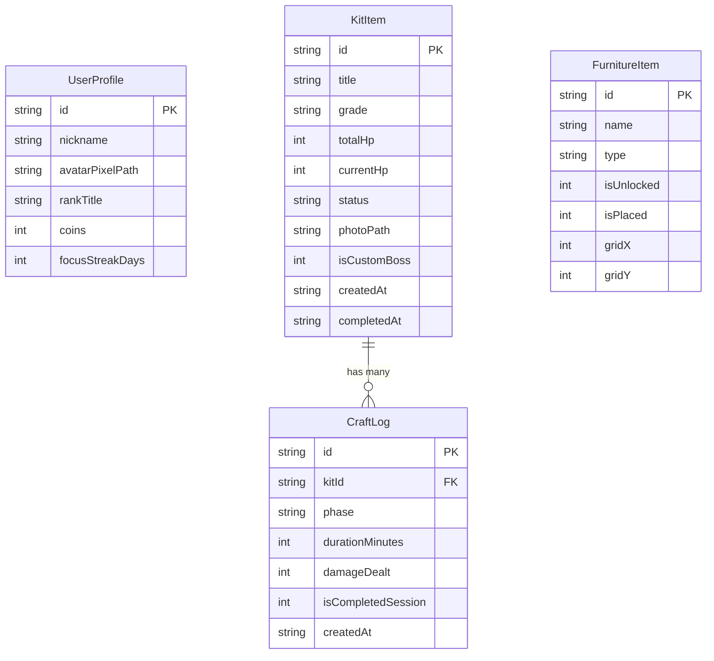

# 《罪普拉 RPG（Tsumi-Pura RPG）》代碼庫現況深度調查報告 (Codebase Analysis)

- **調查時間**：2026-09-11
- **調查員**：`teamwork_preview_explorer` (Codebase Explorer 1)
- **專案路徑**：`c:\Users\k-kaw\Documents\antigravity\nifty-heisenberg`
- **參照規格**：`ORIGINAL_REQUEST.md` 及 `SPEC.md`

---

## 1. 執行摘要 (Executive Summary)

目前專案處於**早期原型 (MVP Prototype)** 階段。開發者已在 `lib/main.dart` 中以單一檔案（約 1,018 行）實作出核心番茄鐘戰鬥介面（包含素組、打磨、刻線、噴塗、水貼五大工序切換、5 秒除錯模式、Mercy Rule 50% 保底計算、震動與浮動跳字等），視覺上具備 8-Bit 暗色風格。

然而，整體功能完成度僅約 **25% ~ 30%**。距離 `ORIGINAL_REQUEST.md` 與 `SPEC.md` 的正式交付標準存在重大落差：
1. **零持久化（Zero Persistence）**：完全沒有本地資料庫（無 SQLite、Hive 或 SharedPreferences），重整或重啟後所有數據（HP、金幣、模型狀態）立即歸零。
2. **單一硬編碼 Boss**：僅有單隻寫死的「綠色普通盒怪（HG 1/144, 500 HP）」，缺乏模型機庫 CRUD（登錄、編輯、刪除、多種盒怪規格與抗性機制）。
3. **無展櫃與歷史日誌**：討伐完成時僅彈出對話框並直接重置 HP，沒有完工展示櫃頁面，亦無施工歷程日誌（CraftLog）。
4. **零音效與離線字體缺乏**：無任何音效套件（無 `audioplayers`）與音訊檔案（`.mp3`/`.wav`）；雖宣告 `Press Start 2P` 但無本地字體資產，依賴網路/系統回退。
5. **靜態分析與測試失敗**：`flutter analyze` 出現 6 個 `unnecessary_underscores` 警告/錯誤；`test/widget_test.dart` 仍為預設計數器範本，導致測試完全失敗。

---

## 2. 環境、套件與資產清查 (Environment & Dependencies)

### 2.1 環境規格
- **Flutter SDK 版本要求**：`^3.10.4`
- **運行平台**：已驗證本機支援 `Windows (desktop)`、`Chrome (web)`、`Edge (web)`。

### 2.2 `pubspec.yaml` 現況檢視
```yaml
environment:
  sdk: ^3.10.4

dependencies:
  flutter:
    sdk: flutter
  cupertino_icons: ^1.0.8
  google_fonts: ^6.2.1
  uuid: ^4.6.0

dev_dependencies:
  flutter_test:
    sdk: flutter
  flutter_lints: ^6.0.0

flutter:
  uses-material-design: true
  assets:
    - assets/images/
```

#### 關鍵落差與套件建議：
1. **資料持久化套件缺失**：
   - 目前未安裝任何資料庫套件。
   - SPEC 要求支援 Windows 與 Web 雙平台離線持久化且零雲端花費。
   - 推薦方案：採用 `shared_preferences`（輕量設定/狀態）或 `sqflite` / `sqflite_common_ffi`（原生支援桌面）搭配 Web 兼容方案，或者純本機免 C 編譯相容的 `hive` / `hive_flutter` / `sembast`。
2. **音效套件缺失**：
   - 缺少音效播放庫，推薦加入 `audioplayers: ^6.0.0`。
3. **狀態管理套件**：
   - 目前完全使用 `setState` 塞在 1,000 行單一 Widget 內，缺乏結構化的狀態分離。建議引入 `provider` 或以清晰的 `ChangeNotifier` / `ValueNotifier` 架構解耦。
4. **離線像素字體資產缺失**：
   - 雖引入 `google_fonts`，但若在無聯網環境或直接使用 `fontFamily: 'Press Start 2P'`，未打包 `.ttf` 於 `assets/fonts/` 會無法保證離線顯示一致。

### 2.3 資產目錄（`assets/`）清查
經對 `assets/` 進行全域掃描，目前僅包含 2 個影像檔案：
- `assets/images/boss_green_box.jpg` (綠色盒怪外盒圖)
- `assets/images/hero.jpg` (工匠勇者頭像)

**缺失資產清單**：
- ❌ 音效資產（`assets/audio/`）：0 個。無 BGM、攻擊剪件聲、砂紙打磨聲、噴塗排氣聲、受擊打擊聲、Quest Clear 勝利音效。
- ❌ 像素字體資產（`assets/fonts/`）：0 個。
- ❌ 特殊盒怪圖片：無 PB 限定幽靈、電鍍黃金石像、彩色透明限定怪、深淵巨神兵外盒圖片。
- ❌ 工序武器與道具 Sprite：無單刃剪鉗、海綿砂紙、鎢鋼推刀、雙動噴筆、水貼鑷子等像素圖示。

---

## 3. 現有程式碼架構與品質審查 (`lib/`)

### 3.1 檔案結構
目前 `lib/` 內**僅有單一檔案**：
```
lib/
└── main.dart (1,018 lines)
```
沒有任何 `models/`、`services/`、`repositories/`、`screens/` 或 `widgets/` 子目錄。

### 3.2 `lib/main.dart` 剖析
- **`TsumiPuraApp` (Lines 9–29)**:
  - 定義應用進入點，深色主題（`0xFF10121A`），設定 `fontFamily: 'Press Start 2P'`。
  - 直接將 `BattleAtelierScreen` 作為首頁。
- **`BattleAtelierScreen` / `_BattleAtelierScreenState` (Lines 31–1018)**:
  - **狀態管理**：單一 State 內控管了 Boss 血量、計時器、動畫、工序技能、對話文字與金幣。
  - **計時邏輯 (Lines 114–175)**：
    - 支援 25 分鐘模式與 5 秒快速測試模式。
    - 透過 `Timer.periodic(const Duration(seconds: 1))` 每秒遞減。
  - **傷害與保底運算 (Lines 177–216)**：
    - `basePoints = 100.0 * elapsedRatio;`
    - `totalDamage = basePoints * multiplier;`
    - 若中途中斷：`totalDamage = totalDamage * 0.5;`（Mercy Rule 50%）。
    - 水貼終結技能限制 Boss 殘血 20% 以下始可發動（Lines 118–121, 864–881）。
    - 結算時掉落塑料金幣（`userCoins`）。
  - **視覺與動效 (Lines 218–236, 608–756)**：
    - `_shakeController`：受到攻擊時產生震動位移。
    - `_idleController`：Boss 與勇者呼吸起伏。
    - `_floatingDamageText`：飄起紅色爆擊或黃色 MERCY 跳字。
    - `GridPaper` 模擬工作台網格掃描線。
  - **討伐結算彈窗 (Lines 256–415)**：
    - HP <= 0 時彈出 `★ QUEST CLEAR ★`。
    - 點擊「收錄至展示櫃」僅執行 `currentHp = maxHp` 重設數值，並無儲存。

### 3.3 靜態分析問題 (Static Analysis)
執行 `flutter analyze` 輸出：
```
info - Unnecessary use of multiple underscores - lib\main.dart:298:37 - unnecessary_underscores
info - Unnecessary use of multiple underscores - lib\main.dart:298:41 - unnecessary_underscores
info - Unnecessary use of multiple underscores - lib\main.dart:676:39 - unnecessary_underscores
info - Unnecessary use of multiple underscores - lib\main.dart:676:43 - unnecessary_underscores
info - Unnecessary use of multiple underscores - lib\main.dart:719:39 - unnecessary_underscores
info - Unnecessary use of multiple underscores - lib\main.dart:719:43 - unnecessary_underscores
```
原因為 `errorBuilder: (_, __, ___)` 在 Dart 3.7+ 下觸發 `unnecessary_underscores` 規則，導致 analyzer 報錯退出（Code 1）。

### 3.4 自動化測試狀況 (`test/`)
執行 `flutter test`：
- `test/widget_test.dart` 仍是 Flutter 預設的計數器點擊測試，針對 `TsumiPuraApp` 執行必然報錯（找不到計數器與 `+` 號）。
- 目前對傷害公式、Mercy Rule、工序倍率、計時器邏輯**完全零單元測試**。

---

## 4. 需求與規格對照表 (Requirements Gap Matrix)

| 需求項目 | SPEC 章節 | 現況與已實作部分 | 缺漏與待實現項目 | 差距等級 |
| :--- | :--- | :--- | :--- | :--- |
| **R1. 番茄鐘與戰鬥循環** | §2.1 ~ §2.3 | 實作 25m 與 5s 測試計時；實作五大工序倍率（1.0x/1.2x/1.5x/2.0x/2.5x）；實作水貼 20% 殘血處決鎖定；實作中途中斷 50% 保底傷害計算與跳字。 | 1. 缺 5 分鐘休息循環與休息介面。<br>2. 缺 50 分鐘深度專注模式（220 基礎點數加成）。<br>3. 缺工序特殊機制（打磨疊加破甲、刻線暴擊判定）。<br>4. 缺特殊盒怪機制（PB 飄移、電鍍減傷/水口暴擊、彩透反噬、PG 雙階段血條）。<br>5. 缺匠人天賦樹（Lv.5 70%、Lv.10 90% 保底）。 | **中度 (Medium)** |
| **R2. 本地資料持久化與日誌** | §7 (Schema) | 僅有 in-memory 變數，無持久化。 | 1. 缺少本地資料庫/持久化引擎（支援 Windows / Web 離線）。<br>2. 缺少 `KitItem` 資料模型與資料表。<br>3. 缺少 `CraftLog` 施工日誌資料模型與資料表。<br>4. 缺少 `UserProfile`（稱號、金幣）持久化。<br>5. 缺少「工時與施工日誌回顧檢視介面」。 | **極高 (Critical)** |
| **R3. 機庫與展示櫃** | §3, §4, §5 | 僅有硬編碼綠色盒怪；通關對話框僅能手動重置 HP。 | 1. 缺少「模型機庫（Hangar）」頁面與 CRUD 功能（新增模型、選擇級別 EG/HG/RG/MG/PG、自訂血量、刪除、切換當前目標）。<br>2. 缺少「完工像素展示櫃（Showcase Gallery）」頁面。<br>3. 缺少展品詳細頁（完工時間、累積工時圓餅圖、漆料備註）。 | **極高 (Critical)** |
| **R4. 8-Bit 像素體驗與反饋** | §1, §4, §5 | 具備暗黑街機配色、掃描線、受擊震動、跳字、Boss/勇者待機微動。 | 1. 完全缺乏 8-Bit 復古音效（開工、剪切、打磨、噴塗、通關）。<br>2. 缺少離線打包之像素字體。<br>3. 缺少動森風 2.5D 工作室（工作台、噴漆箱、山積角落堆疊、展示櫃互動）。<br>4. 缺少動態真實時間日夜光影。<br>5. 缺少社群戰報圖卡生成（SNS Card）。 | **高 (High)** |
| **驗收標準 (Acceptance)** | R4 結尾 | 支援 Windows 與 Web 本機運行，零外部付費 API。 | 1. `flutter analyze` 需修復至 0 錯誤 0 警告。<br>2. 需撰寫涵蓋傷害公式、倍率、Mercy Rule、持久化的單元測試。 | **高 (High)** |

---

## 5. 資料庫模型對照分析 (Data Model Gap)

SPEC.md §7 明確定義了 4 張核心資料表，目前代碼庫中均尚未建立任何對應 Model 或 DAO：



1. **`KitItem`**：管理模型山積清單與戰鬥狀態（Status: Backlog / InProgress / Completed）。
2. **`CraftLog`**：每次工作 session（完整或中斷）的詳細歷史紀錄，關聯至特定模型。
3. **`UserProfile`**：記錄玩家稱號（剪鉗學徒等）、廢流道塑料金幣總額、連續專注天數。
4. **`FurnitureItem`**：管理工作室家具解鎖與擺設狀態。

---

## 6. 架構重構與模組劃分建議 (Target Architecture)

建議將原本單一龐大的 `lib/main.dart` 拆解為標準的關注點分離架構：

```
lib/
├── core/
│   ├── audio/           # 音效播放管理器 (AudioService)
│   ├── constants/       # 數值常數、工序倍率、色彩定義
│   ├── database/        # 本機儲存抽象介面與實作 (LocalStorage / DB)
│   └── theme/           # 8-Bit 像素主題、字體配置
├── models/
│   ├── craft_log.dart   # 施工日誌模型
│   ├── kit_item.dart    # 模型盒怪實體
│   ├── phase_skill.dart # 工序技能定義
│   └── user_profile.dart# 玩家工匠檔案
├── providers/ / state/
│   ├── battle_provider.dart    # 戰鬥與番茄鐘狀態
│   ├── hangar_provider.dart    # 機庫模型清單 CRUD 狀態
│   └── showcase_provider.dart  # 完工展櫃狀態
├── screens/
│   ├── battle_screen.dart      # 戰鬥番茄鐘核心畫面
│   ├── hangar_screen.dart      # 山積機庫與模型 CRUD
│   ├── history_screen.dart     # 施工日誌回顧
│   ├── main_nav_screen.dart    # 底部/頂部像素風格導航欄
│   └── showcase_screen.dart    # 像素完成品展示櫃
└── widgets/
    ├── boss_hp_bar.dart        # 像素血條組件
    ├── damage_overlay.dart     # 受擊震動與浮動跳字
    ├── dialogue_box.dart       # 8-bit 對話框
    └── pixel_card.dart         # 復古邊框卡片容器
```

---

## 7. 具體待辦清單與優先級建議 (Actionable Roadmap)

### Phase 1: 基礎修復與架構奠基 (P0 - Immediate)
1. **修復靜態分析錯誤**：修復 `lib/main.dart` 中 6 處 `errorBuilder` 的 `unnecessary_underscores`，達成 `flutter analyze` 0 errors。
2. **建立領域模型 (Domain Models)**：實作 `KitItem`、`CraftLog`、`UserProfile`、`PhaseSkill` 之 Dart 類別與 JSON/Map 序列化。
3. **建立跨平台本機持久化服務 (Local Storage Service)**：
   - 支援 Web / Windows 零成本本機儲存（如採用純 Dart / SharedPreferences / Hive 方案）。
4. **補齊單元測試**：
   - 取代 `test/widget_test.dart`。
   - 撰寫 `test/battle_logic_test.dart`（驗證 5 大工序倍率、25m/50m/5s 能量點數換算、殘血 20% 處決限制、Mercy Rule 50% 保底機制）。
   - 撰寫 `test/storage_test.dart`（驗證 CRUD 與持久化讀寫）。

### Phase 2: 機庫管理與展示櫃 (P1 - Core Loop Completion)
1. **模型機庫頁面 (HangarScreen)**：
   - 支援新增模型盒怪（名稱、規格 EG/HG/RG/MG/PG、HP 自動換算）。
   - 支援編輯與刪除模型。
   - 點擊模型可設為當前討伐目標（Active Target），連動切換至戰鬥畫面。
2. **完工展示櫃頁面 (ShowcaseScreen)**：
   - 當模型 HP 歸零，更新狀態為 `Completed` 並記入 `completedAt`。
   - 在展示櫃以像素貨架方式陳列所有完工模型。
   - 點擊查看模型詳情、累計工時與工序占比。
3. **歷史施工日誌頁面 (CraftLogScreen)**：
   - 條列所有開工歷史（日期時間、工序、耗時、造成的傷害、是否中途終止）。

### Phase 3: 番茄鐘完整度與 8-Bit 遊戲體驗升級 (P2 - Juice & Polish)
1. **完整番茄鐘週期**：
   - 支援 25m 工作 + 5m 休息切換。
   - 支援 50m 深度專注模式（220 點數 + 10% 獎勵）。
2. **音效與字體資產補強**：
   - 引入開源免版權 8-Bit 音效（剪件連擊音效、砂紙擦拭音效、受擊打擊音效、勝利號角）。
   - 評估本地嵌入像素字體（確保徹底離線可用）。
3. **特殊盒怪機制**：
   - 根據模型等級（PB 幽靈、電鍍黃金石像、PG 巨神兵雙階段）套用特殊抗性與機制。

---

## 8. 結論 (Conclusion)

現有代碼庫具備極佳的起步視覺風格與初步戰鬥動效，核心戰鬥數值乘數（Snap-fit 1.0x ~ Finishing 2.5x 及 Mercy 50%）邏輯驗證方向正確。但因缺少**持久化儲存**、**機庫 CRUD**、**完工展櫃**與**音效/日誌系統**，且集中於單一檔案中，目前僅為純前端展示原型。依據上述規劃進行模組化重構與功能補齊，將能平滑過渡為完整的《罪普拉 RPG》獨立遊戲。
