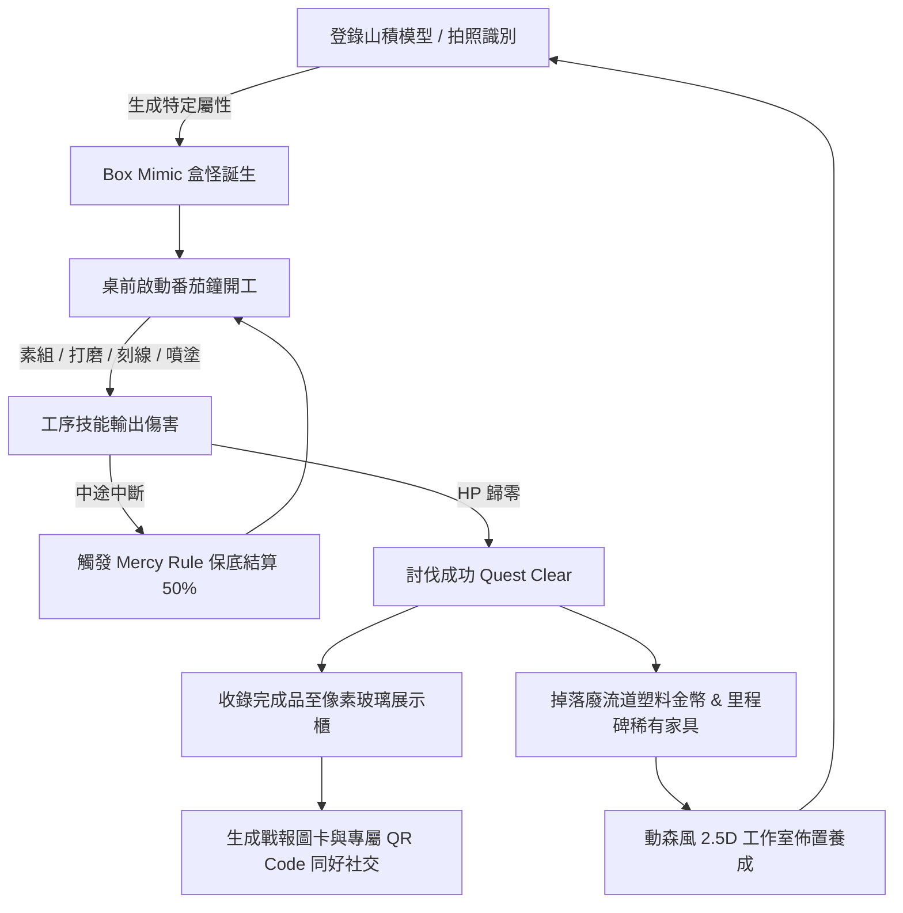

# 《罪普拉 RPG（Tsumi-Pura RPG）》超完整專案規格書 (Single Source of Truth)

---

## 1. 核心世界觀與遊戲循環（Core Loop）

### 1.1 核心世界觀
在模型玩家的世界中，有一個無法逃避的沉重罪業——**「山積（罪プラ，Tsumi-Pura）」**。
那些買回家卻因為工作繁忙、熱情消退或恐懼失敗而積累在房間角落的模型盒，隨著時間推移吸收了玩家的「罪惡感」與「模型魂」，具象化為活體怪物——**「模型盒擬態怪（Box Mimic）」**。
玩家扮演一名擁有模型工匠之心的勇者，透過每一次坐在工作桌前啟動番茄鐘的專注時光，揮動手中的剪鉗、砂紙、推刀與噴筆，將罪普拉怪獸一一討伐淨化，讓它們恢復成光彩奪目的模型完成品，打造專屬於自己的夢想工作室。

### 1.2 基本循環架構（Core Game Loop）


1. **登錄山積（Spawn Boss）**：玩家手動輸入或使用 AI 拍攝實體外盒，生成對應等階與特性的 Box Mimic 怪物。
2. **桌前開工（Craft Battle）**：啟動番茄鐘（標準 25 分鐘或 50 分鐘深度工時），小人坐上工作台，切換工序技能即時對 Boss 造成累積傷害。
3. **討伐成功（Quest Clear）**：Boss 血量歸零，模型破盒完工，移入展示櫃。
4. **資源回流（Plastic Recycle）**：每次開工與討伐均會掉落「廢流道塑料金幣（Recycled Plastic Coins）」，可用於收購家具或升級工具。
5. **工坊養成（Atelier Customization）**：在 2.5D 動森風工作室中擺放工作桌、抽風箱、展示櫃與生活家具，隨真實時間享受光影變化。
6. **社交與名片（Social & Showcase）**：生成包含完工實拍照與專屬像素頭像的戰報圖卡，好友掃描 QR Code 即可實時參訪工作室。

---

## 2. 戰鬥數值與工序技能矩陣（Battle Engine）

### 2.1 基礎能量與時長換算
- **標準番茄鐘**：1 個工作階段（25 min）= **100 基礎點數（Base Points）**。
- **長工時專注模式**：支援 50 分鐘深度模式 = **220 基礎點數**（包含 10% 專注獎勵加成）。
- **除錯/快速測試模式**：5 秒 = 100 基礎點數（供開發與除錯驗證）。

### 2.2 工序技能倍率矩陣（Phase Multipliers）
各工序具備不同的輸出定位與技能特色：

| 工序名稱 | 日文標記 | 傷害倍率 | 技能類型 | 技能描述與附加機制 |
| :--- | :--- | :--- | :--- | :--- |
| **剪件/素組** | 仮組み (Snap-fit) | **1.0x** | 普攻連擊 | 基礎攻擊，穩定累積連擊條（Combo Bar），不消耗額外精神力。 |
| **修件打磨** | ヤスリ掛け (Sanding) | **1.2x** | 破甲穿刺 | 削弱 Boss 防禦，每次命中提升後續傷害 2%（最高疊加至 20%）。 |
| **刻線/改件** | スジ彫り (Detailing) | **1.5x** | 弱點打擊 | 高暴擊率爆發傷害，若擊中判定點觸發 1.5 倍暴擊。 |
| **遮蓋/噴塗** | エアブラシ (Airbrush) | **2.0x** | 元素蓄力轟炸 | 範圍重擊，傷害翻倍；具備冷卻或蓄力條件，小人佩戴防毒面具。 |
| **水貼/舊化/消光** | デカール・仕上げ (Finishing) | **2.5x** | 終結處決技 | **限 Boss 殘血 20% 以下解鎖**，一擊給予毀滅性終結輸出。 |

### 2.3 中斷保護機制（Mercy Rule）與匠人天賦
- **中斷保護規則**：
  模型製作常因家人呼喚、快乾膠打翻或缺件等不可抗力中斷。中斷時**絕不扣減已產出之點數為 0**：
  $$\text{中斷傷害} = \text{基礎點數} \times \left( \frac{\text{已進行秒數}}{\text{總秒數}} \right) \times \text{工序倍率} \times 50\%$$
- **匠人專注被動天賦樹（Craftsman Talents）**：
  - **Lv.1 基礎專注**：中斷保底 50% 傷害結算。
  - **Lv.5 沉浸心流**：中斷損失降至 30%（保底 70% 傷害）。
  - **Lv.10 匠之定力**：中斷損失降至 10%（保底 90% 傷害）。

---

## 3. 模型盒怪種類與特性（Box Mimic Types）

| 盒怪種類 | 英文/日文代號 | 對應模型規格 | 基礎血量 (HP) | 特殊抗性與機制特點 |
| :--- | :--- | :--- | :--- | :--- |
| **普通山積怪** | Standard Mimic | 入門級 EG / HG (綠/藍盒) | **300 ~ 600** | 無特殊抗性，新手教學與日常常態敵人。 |
| **PB 限定幽靈** | PB Ghost (プレバン幽霊) | 網絡限定 PB (單色盒) | **1,200** | 帶有【炒價光環】動搖特效，每次攻擊結算時有機率使時間飄移。 |
| **電鍍黃金石像** | Coating Golem | 特殊電鍍 / 金屬質感盒 | **2,000** | 高物理防禦；**打磨傷害減半 (0.6x)**，但若觸發隱藏水口判定則爆發 **2.0x 暴擊**。 |
| **透明脆化水晶獸** | Clear Beast (彩透怪) | 彩色透明限定版 | **1,500** | 材料脆化，中途放棄中斷時觸發【水口白化】反噬，扣除小人 10 點活力。 |
| **深淵巨神兵** | Titan Mimic (深淵大黑盒) | 旗艦級 PG / 高難度 GK | **5,000+** | **雙階段血條**：第一階段「骨架層（Inner Frame）」，第二階段「外甲裝配層（Outer Armor）」。 |

---

## 4. 動森風個人模型工坊（Atelier Room & Furniture）

### 4.1 視角與時間光影系統
- **視角**：採用 2.5D 45 度俯視角（Isometric Pixel View）。
- **動態日夜光影**：工作室隨玩家系統真實時間切換（白天有柔和窗光灑入、傍晚帶橘紅夕陽、深夜窗外轉黑且工作燈微亮）。

### 4.2 核心功能家具（Functional Furniture）
1. **工匠工作台（Crafting Workbench）**：
   - 工作室的核心。點擊直接展開番茄鐘開工介面，小人像素角色拉出椅子坐下，桌面擺出模型板件。
2. **抽風噴漆箱（Spray Booth）**：
   - 選擇「噴塗」工序時，小人移步至噴漆箱前，頭戴防毒面具，排風扇轉動並帶有微粒排風特效。
3. **山積角落（Guilt Corner）**：
   - 位於工作室一角堆疊的盒子堆。數量隨玩家未完成的 `KitItem` 數量動態堆高（若累積超過 20 盒，將觸發模型盒塌陷趣味動畫）。
4. **玻璃展示櫃（Glass Showcase Cabinet）**：
   - 點擊後開啟 3D/像素旋轉貨架，陳列所有討伐成功的模型完成品。

### 4.3 雙軌家具獲取系統
- **廢流道塑料金幣商店（Plastic Recycled Shop）**：
  - 番茄鐘每專注 1 分鐘掉落 1 枚「塑料金幣」，可用於購買造型壁紙、木地板、吸音海綿、咖啡壺、收納抽屜等。
- **里程碑成就家具（Trophy Furniture）**：
  - 【完成首隻 MG 盒怪】獎勵：**放大鏡工作立燈**。
  - 【完成首度全噴塗】獎勵：**專業雙渦輪抽風箱**。
  - 【討伐 PG 巨神兵】獎勵：**360 度旋轉發光展台**。
  - 【完成首款 GK 模型】獎勵：**超音波零件清洗機**。

---

## 5. 完成品展示與同好社交（Showcase & Social）

### 5.1 展品詳情頁（Model Showcase Detail）
- **多角度實拍展示**：支援上傳 4~6 張高清完成品實拍照，並支援微縮展示短片或 GIF。
- **身分證銘牌**：記錄模型名稱、比例規格（1/144、1/100 等）、完成日期、工匠簽名。
- **工時佔比圓餅圖**：記錄該模型的總製作工時，並以圓餅圖呈現「素組 30% / 打磨 25% / 刻線 15% / 噴塗 30%」。
- **塗裝色號紀錄表**：可自定義備註使用的漆料型號（例如：Gaia 002、Mr.Color C33）。

### 5.2 同好互訪與名片系統
- **工匠動態名片（Modeler Business Card）**：
  - 包含玩家的 AI 像素頭像、工匠段位稱號（從「剪鉗學徒」到「傳奇原型師」）、山積殲滅率、專屬個人 QR Code。
- **工作室互訪**：
  - 掃描好友 QR Code 後，玩家小人可直接「走進」好友的 2.5D 工作室自由走動與參觀展示櫃。
  - **軟木塞留言板**：好友可在留言板貼上像素便利貼留言。
  - **投幣讚賞**：可消耗金幣向好友的展示櫃投擲「金色漆罐」打賞。
- **社群分享戰報圖卡（SNS Card）**：
  - 討伐完工時，一鍵生成 9:16 或 1:1 圖卡（包含破碎的 Boss 盒怪、勇者勝利姿勢、完成品實拍照、總耗時與名片 QR），方便分享至 X (Twitter) 或 Instagram。

---

## 6. AI 擴展與商業化（AI & Monetization）

### 6.1 核心 AI 擴充功能
1. **外盒照片轉像素 Boss（Photo-to-Pixel Mimic）**：
   - 拍下實體模型外盒照片（包括老舊絕版模型），AI Vision 自動擷取盒繪色彩與輪廓特徵，生成專屬 16-bit 像素盒怪 Sprite。
2. **AI 自定義模型師像素頭像**：
   - 上傳個人自拍照或輸入關鍵字 Prompt，生成專屬模型師工裝像素小人頭像。

### 6.2 零負擔商業化設計（Monetization）
- **基礎遊戲承諾**：核心番茄鐘、戰鬥數值、本機存檔、機庫管理與像素美術 **100% 永久免費，絕無付費數值破壞平衡**。
- **AI 加值代幣包（Token Packs）**：提供雲端 AI 轉換外盒與頭像之單次代幣購買。
- **PRO 會員買斷制（Atelier Supporter Pass）**：
  - 解鎖無限次 AI 像素轉換。
  - 戰報圖卡去除浮水印。
  - 解鎖限定工匠服飾（如職人作務衣、賽博噴漆圍裙）。

---

## 7. 資料庫 Schema 設計（SQLite / 本機持久化）

```sql
-- 模型項目資料表
CREATE TABLE KitItem (
    id TEXT PRIMARY KEY,
    title TEXT NOT NULL,
    grade TEXT NOT NULL, -- EG, HG, RG, MG, PG, GK
    totalHp INTEGER NOT NULL,
    currentHp INTEGER NOT NULL,
    status TEXT NOT NULL, -- Backlog (山積), InProgress (施工中), Completed (已完工)
    photoPath TEXT,
    isCustomBoss INTEGER DEFAULT 0, -- 0: 預設, 1: AI生成
    createdAt TEXT NOT NULL,
    completedAt TEXT
);

-- 施工紀錄日誌資料表
CREATE TABLE CraftLog (
    id TEXT PRIMARY KEY,
    kitId TEXT NOT NULL,
    phase TEXT NOT NULL, -- Snap-fit, Sanding, Detailing, Airbrush, Finishing
    durationMinutes INTEGER NOT NULL,
    damageDealt INTEGER NOT NULL,
    isCompletedSession INTEGER NOT NULL, -- 1: 完整完成, 0: 中途中斷
    createdAt TEXT NOT NULL,
    FOREIGN KEY (kitId) REFERENCES KitItem(id) ON DELETE CASCADE
);

-- 工作室家具資料表
CREATE TABLE FurnitureItem (
    id TEXT PRIMARY KEY,
    name TEXT NOT NULL,
    type TEXT NOT NULL, -- Workbench, Booth, Showcase, Decoration
    isUnlocked INTEGER DEFAULT 0,
    isPlaced INTEGER DEFAULT 0,
    gridX INTEGER DEFAULT 0,
    gridY INTEGER DEFAULT 0,
    unlockRequirement TEXT
);

-- 玩家設定檔資料表
CREATE TABLE UserProfile (
    id TEXT PRIMARY KEY,
    nickname TEXT NOT NULL DEFAULT '模型工匠',
    avatarPixelPath TEXT,
    rankTitle TEXT NOT NULL DEFAULT '剪鉗學徒',
    coins INTEGER DEFAULT 0, -- 廢流道塑料金幣
    focusStreakDays INTEGER DEFAULT 0
);
```
